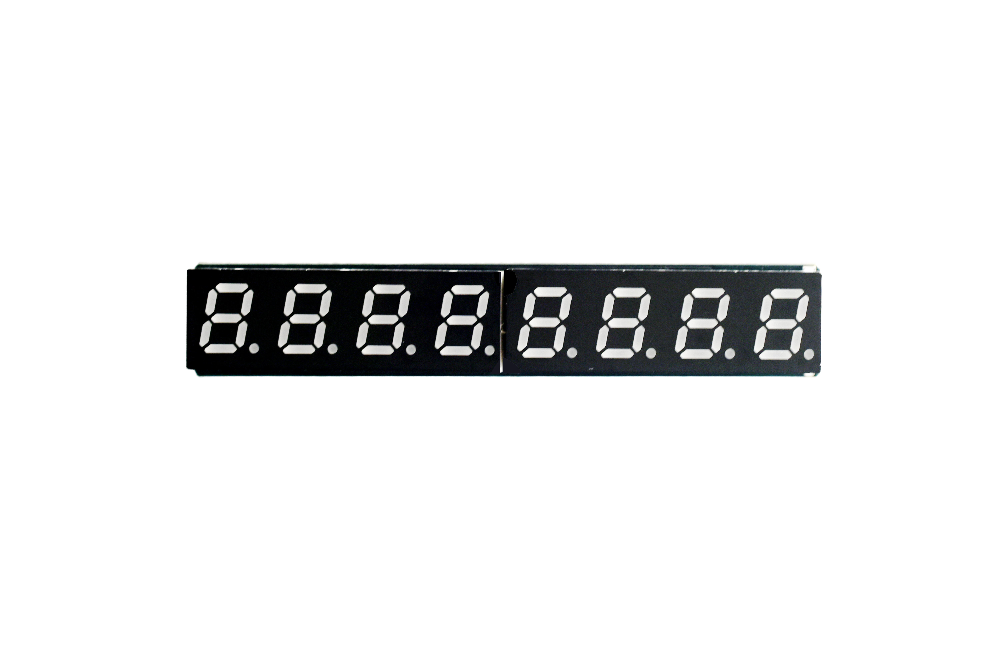
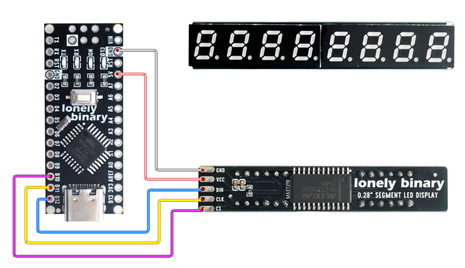
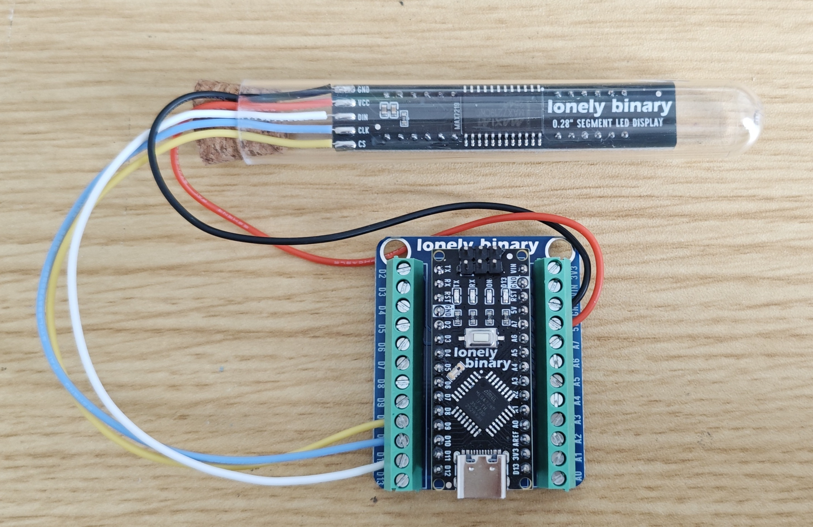
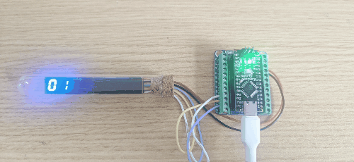

# 0.28 SEG Display

## Function

This is a **0.28" eight-digit 7-segment LED display module** driven by a **MAX7219** (serial LED driver). Use it for multi-digit numbers, counters, or time-style readouts.

**Two variants** (same **GND / VCC / DIN / CLK / CS** pinout and electrical design; only the digit / symbol layout on the panel differs):

- **Decimal point** — eight digits with per-digit decimal points for general numeric use.
- **Clock** — same interface; panel adds a **middle colon** (two colon dots between the two groups of digits) for time-style display.

**Interface (5 pins):**

| Pin | Role |
| --- | --- |
| **GND** | Ground |
| **VCC** | Power — **3.3 V** or **5 V** (both supported) |
| **DIN** | Serial data in (to the MAX7219) |
| **CLK** | Serial clock |
| **CS** | Chip select (**LOAD**) |

The driver is **MAX7219**: **DIN**, **CLK**, and **CS** (LOAD) plus **VCC** / **GND**.

This folder provides:

- **Photos / images**: see `images/`
- **Arduino UNO R3 demo sketch**: see “Arduino Uno R3 Example” below and `codes/`

## Quick Start (UNO R3)

1. Install the **LedControl** library in Arduino IDE (**Sketch → Include Library → Manage Libraries…** → search `LedControl`).
2. Open `codes/Uno_0288SEG.ino` and set **`DIN_PIN`**, **`CLK_PIN`**, **`CS_PIN`** to match your wiring.
3. Connect **GND**, **VCC**, **DIN**, **CLK**, **CS** per the table above.
4. Select **Arduino Uno** and the correct port, then upload.

## Appearance

|  |  |
| :--: | :--: |
| **Front (component side)** | **Back (solder side)** |

## Arduino Uno R3 Example

### Goal

On power-up, stage 1 is the same for both variants: **increment** from **0** to **7** left to right (digits fill **0**, **01**, … **01234567**), then blank.

Stage 2 depends on the variant:

- **Clock version:** show **08:30** and **17:45** (colons use digit dots).
- **Decimal-point version:** increment **0…7** again, but **each digit turns on with its DP dot**.

### Wiring (example)

Example Arduino connections (change in code if you rewire):

- **DIN** → D12  
- **CLK** → D11  
- **CS** → D10  
- **VCC** → **3.3 V** or **5 V**  
- **GND** → **GND**  





### Code

File: `codes/Uno_0288SEG.ino`

Uses the **LedControl** library (**MAX7219**, **DIN / CLK / CS**).

```cpp
// 0.28" eight-digit 7-segment module + MAX7219 — DIN / CLK / CS (LOAD) + GND / VCC
// VCC: 3.3 V or 5 V (both OK). Uses LedControl (Library Manager: "LedControl").

#include "LedControl.h"

// Variant selection:
// 0 = Decimal-point version (DP on digits)
// 1 = Clock version (middle colons are wired to digit dots; see COLON_* below)
#define VARIANT_CLOCK 1

const int DIN_PIN = 12;  // DIN — change if you rewire
const int CLK_PIN = 11;  // CLK
const int CS_PIN  = 10;  // CS / LOAD

LedControl lc = LedControl(DIN_PIN, CLK_PIN, CS_PIN, 1);

// Clock-variant colon mapping (verified by dot scan):
// - digit 1 dot controls the left colon
// - digit 5 dot controls the right colon
// Digit index: 0 = leftmost, 7 = rightmost.
#define COLON_LEFT_DIGIT  1
#define COLON_RIGHT_DIGIT 5

// Count up 0…7 on digits left to right: show "0", then "01", … ending in "01234567", then blank.
static void show0to7Incremental() {
  lc.clearDisplay(0);
  for (int pos = 0; pos < 8; pos++) {
    lc.setDigit(0, pos, (byte)pos, false);
    delay(180);
  }
  delay(350);
  lc.clearDisplay(0);
  delay(150);
}

// Decimal-point version demo: show 01234567 with every digit dot on.
static void show0to7WithDotsIncremental() {
  lc.clearDisplay(0);
  for (int pos = 0; pos < 8; pos++) {
    // Fill digits left-to-right; each digit has its DP on.
    lc.setDigit(0, pos, (byte)pos, true);
    delay(180);
  }
  delay(600);
}

// Two demo times on one line: 08:30 and 17:45
// Clock variant: use digit dots as colons (digit 1 and digit 5).
// Decimal-point variant: use a different demo (all digits with dots).
static void showTwoTimes() {
#if VARIANT_CLOCK
  const bool colonL = true;
  const bool colonR = true;
#else
  const bool colonL = false;
  const bool colonR = false;
#endif

  lc.setDigit(0, 0, 0, false);
  lc.setDigit(0, 1, 8, colonL); // clock variant: left colon
  lc.setDigit(0, 2, 3, false);
  lc.setDigit(0, 3, 0, false);

  lc.setDigit(0, 4, 1, false);
  lc.setDigit(0, 5, 7, colonR); // clock variant: right colon
  lc.setDigit(0, 6, 4, false);
  lc.setDigit(0, 7, 5, false);
}

void setup() {
  lc.shutdown(0, false);
  lc.setIntensity(0, 8);
  lc.clearDisplay(0);

  show0to7Incremental();
#if VARIANT_CLOCK
  showTwoTimes();
#else
  show0to7WithDotsIncremental();
#endif
}

void loop() {
  delay(1000);
}
```

### Effect

|  |  |
| :--: | :--: |
| **Clock version** | **Decimal-point version** |

### Code Walkthrough

**1) LedControl instance**

- Third parameter is **CS** (chip select / LOAD). The last argument **`1`** is the number of cascaded MAX7219 chips (one chip drives up to 8 digits).

```cpp
const int DIN_PIN = 12;
const int CLK_PIN = 11;
const int CS_PIN  = 10;
LedControl lc = LedControl(DIN_PIN, CLK_PIN, CS_PIN, 1);
```

**2) `setup`**

- `shutdown(0, false)` turns the display on.  
- `setIntensity` sets brightness (**0..15**; 0 = dim, 15 = bright).  
- `clearDisplay` blanks all digits.

```cpp
void setup() {
  lc.shutdown(0, false);
  lc.setIntensity(0, 8);
  lc.clearDisplay(0);
  // ...
}
```

**3) `setDigit`**

- `setDigit(device, digit, value, dot)` — **`digit`** is **0…7**; on this module **0 = leftmost**, **7 = rightmost**.

```cpp
// Show digit "8" on the second position (digit=1) and turn its dot on.
lc.setDigit(0, 1, 8, true);
```

- **Variant switch:** set `#define VARIANT_CLOCK` in `codes/Uno_0288SEG.ino`.
  - Decimal-point version: set `VARIANT_CLOCK` to **0**.
  - Clock version: set `VARIANT_CLOCK` to **1**.

```cpp
#define VARIANT_CLOCK 1
```

- **Clock variant mapping (verified):** the colons are controlled by **digit 1** dot and **digit 5** dot.

```cpp
#define COLON_LEFT_DIGIT  1
#define COLON_RIGHT_DIGIT 5
```

Because the colons share the **dot** signal on this clock PCB, turning `dot=true` on **digit 1** / **digit 5** will also light the colons.

**4) Demo stages**

- Stage 1 is `show0to7Incremental()` (fills 0…7, then clears).

```cpp
static void show0to7Incremental() {
  lc.clearDisplay(0);
  for (int pos = 0; pos < 8; pos++) {
    lc.setDigit(0, pos, (byte)pos, false);
    delay(180);
  }
  delay(350);
  lc.clearDisplay(0);
  delay(150);
}
```

- Stage 2:
  - Clock version: `showTwoTimes()` lights **08:30** and **17:45**.
  - Decimal-point version: `show0to7WithDotsIncremental()` fills 0…7 again, each digit with its **DP** on.

```cpp
// Stage 2 selection:
show0to7Incremental();
#if VARIANT_CLOCK
showTwoTimes();
#else
show0to7WithDotsIncremental();
#endif
```
