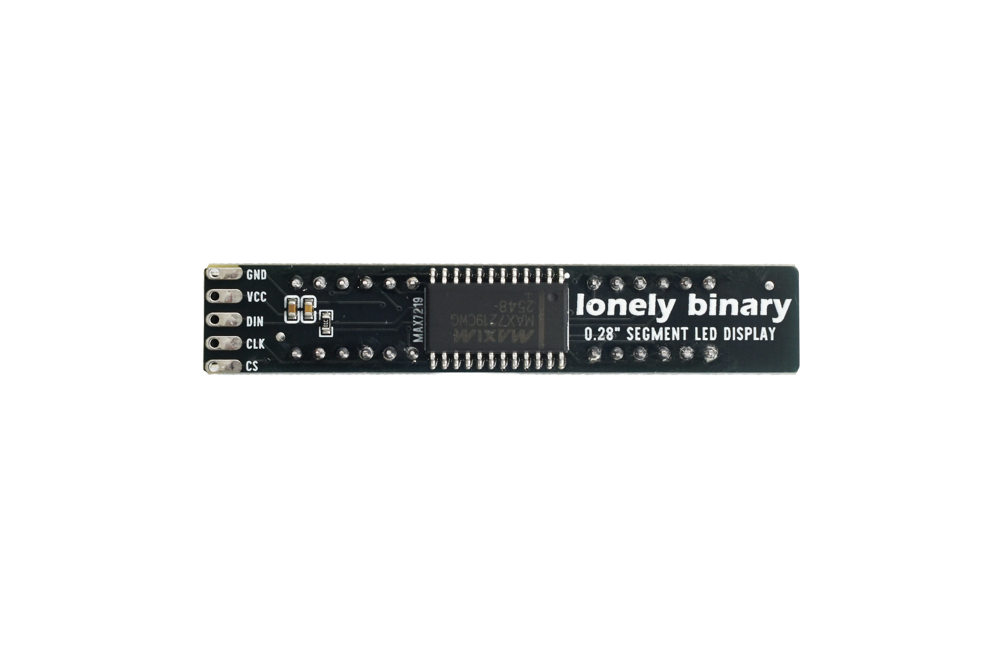
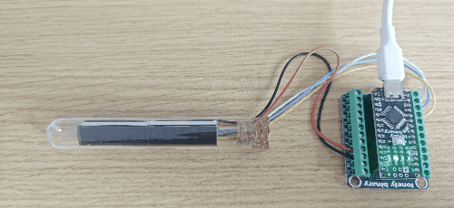

# 0.28 inch Seven Seg Display

## Function

This is a **0.28" eight-digit 7-segment LED display module** driven by a **MAX7219** (serial LED driver). Use it for multi-digit numbers, counters, or time-style readouts.

## What You Will Learn

- How to install and use an **Arduino library** (LedControl)
- What a **driver IC** (MAX7219) does and why it simplifies multi-digit control
- How to set individual digits on an 8-digit display using `setDigit()`
- How to adjust **brightness** in code with `setIntensity()`
- How to use **`#define`** to switch between two hardware variants without rewriting the whole sketch

**Two variants** (same **GND / VCC / DIN / CLK / CS** pinout and electrical design; only the digit / symbol layout on the panel differs):

- **Decimal point** — eight digits with per-digit decimal points for general numeric use.
- **Clock** — same interface; panel adds a **middle colon** (two colon dots between the two groups of digits) for time-style display.

**Interface (5 pins):**

| Pin | Role |
| --- | --- |
| **GND** | Ground |
| **VCC** | Power — **3.3 V** or **5 V** (both supported) |
| **DIN** | Serial data in (to the MAX7219) |
| **CLK** | Serial clock |
| **CS** | Chip select (**LOAD**) |

The driver is **MAX7219**: **DIN**, **CLK**, and **CS** (LOAD) plus **VCC** / **GND**.

This folder provides:

- **Photos / images**: see `images/`
- **Arduino UNO R3 demo sketch**: see “Arduino Uno R3 Example” below and `codes/`

## Quick Start (UNO R3)

1. Install the **LedControl** library in Arduino IDE (**Sketch → Include Library → Manage Libraries…** → search `LedControl`).
2. Open `codes/Uno_0288SEG.ino` and set **`DIN_PIN`**, **`CLK_PIN`**, **`CS_PIN`** to match your wiring.
3. Connect **GND**, **VCC**, **DIN**, **CLK**, **CS** per the table above.
4. Select **Arduino Uno** and the correct port, then upload.

## Appearance

|  |  |
| :--: | :--: |
| **Front (component side)** | **Back (solder side)** |

## LED Color ↔ Silkscreen (P/N) Table

| LED color | Silkscreen / P/N |
| :-- | :-- |
| Blue | `2481AB-2` |
| Red | `2841AS-CD` |

## Arduino Uno R3 Example

### Goal

On power-up, stage 1 is the same for both variants: **increment** from **0** to **7** left to right (digits fill **0**, **01**, … **01234567**), then blank.

Stage 2 depends on the variant:

- **Clock version:** show **08:30** and **17:45** (colons use digit dots).
- **Decimal-point version:** increment **0…7** again, but **each digit turns on with its DP dot**.

### Wiring (example)

Example Arduino connections (change in code if you rewire):

- **DIN** → D12  
- **CLK** → D11  
- **CS** → D10  
- **VCC** → **3.3 V** or **5 V**  
- **GND** → **GND**  


### Code

> **New to libraries or driver ICs?** Read the [Key Concepts](#key-concepts) section below first — it explains what `#include` does, why `shutdown()` must be called, and how the MAX7219 controls 8 digits from 3 wires.

File: `codes/Uno_0288SEG.ino`

Uses the **LedControl** library (**MAX7219**, **DIN / CLK / CS**).

```cpp
// 0.28" eight-digit 7-segment module + MAX7219 — DIN / CLK / CS (LOAD) + GND / VCC
// VCC: 3.3 V or 5 V (both OK). Uses LedControl (Library Manager: "LedControl").

#include "LedControl.h"

// Variant selection:
// 0 = Decimal-point version (DP on digits)
// 1 = Clock version (middle colons are wired to digit dots; see COLON_* below)
#define VARIANT_CLOCK 1

const int DIN_PIN = 12;  // DIN — change if you rewire
const int CLK_PIN = 11;  // CLK
const int CS_PIN  = 10;  // CS / LOAD

LedControl lc = LedControl(DIN_PIN, CLK_PIN, CS_PIN, 1);

// Clock-variant colon mapping (verified by dot scan):
// - digit 1 dot controls the left colon
// - digit 5 dot controls the right colon
// Digit index: 0 = leftmost, 7 = rightmost.
#define COLON_LEFT_DIGIT  1
#define COLON_RIGHT_DIGIT 5

// Count up 0…7 on digits left to right: show "0", then "01", … ending in "01234567", then blank.
static void show0to7Incremental() {
  lc.clearDisplay(0);
  for (int pos = 0; pos < 8; pos++) {
    lc.setDigit(0, pos, (byte)pos, false);
    delay(180);
  }
  delay(350);
  lc.clearDisplay(0);
  delay(150);
}

// Decimal-point version demo: show 01234567 with every digit dot on.
static void show0to7WithDotsIncremental() {
  lc.clearDisplay(0);
  for (int pos = 0; pos < 8; pos++) {
    // Fill digits left-to-right; each digit has its DP on.
    lc.setDigit(0, pos, (byte)pos, true);
    delay(180);
  }
  delay(600);
}

// Two demo times on one line: 08:30 and 17:45
// Clock variant: use digit dots as colons (digit 1 and digit 5).
// Decimal-point variant: use a different demo (all digits with dots).
static void showTwoTimes() {
#if VARIANT_CLOCK
  const bool colonL = true;
  const bool colonR = true;
#else
  const bool colonL = false;
  const bool colonR = false;
#endif

  lc.setDigit(0, 0, 0, false);
  lc.setDigit(0, 1, 8, colonL); // clock variant: left colon
  lc.setDigit(0, 2, 3, false);
  lc.setDigit(0, 3, 0, false);

  lc.setDigit(0, 4, 1, false);
  lc.setDigit(0, 5, 7, colonR); // clock variant: right colon
  lc.setDigit(0, 6, 4, false);
  lc.setDigit(0, 7, 5, false);
}

void setup() {
  lc.shutdown(0, false);
  lc.setIntensity(0, 8);
  lc.clearDisplay(0);

  show0to7Incremental();
#if VARIANT_CLOCK
  showTwoTimes();
#else
  show0to7WithDotsIncremental();
#endif
}

void loop() {
  delay(1000);
}
```

### Effect

|  |  |
| :--: | :--: |
| **Clock version** | **Decimal-point version** |

### Code Walkthrough

**1) LedControl instance**

- Third parameter is **CS** (chip select / LOAD). The last argument **`1`** is the number of cascaded MAX7219 chips (one chip drives up to 8 digits).

```cpp
const int DIN_PIN = 12;
const int CLK_PIN = 11;
const int CS_PIN  = 10;
LedControl lc = LedControl(DIN_PIN, CLK_PIN, CS_PIN, 1);
```

**2) `setup`**

- `shutdown(0, false)` turns the display on.  
- `setIntensity` sets brightness (**0..15**; 0 = dim, 15 = bright).  
- `clearDisplay` blanks all digits.

```cpp
void setup() {
  lc.shutdown(0, false);
  lc.setIntensity(0, 8);
  lc.clearDisplay(0);
  // ...
}
```

**3) `setDigit`**

- `setDigit(device, digit, value, dot)` — **`digit`** is **0…7**; on this module **0 = leftmost**, **7 = rightmost**.

```cpp
// Show digit "8" on the second position (digit=1) and turn its dot on.
lc.setDigit(0, 1, 8, true);
```

- **Variant switch:** set `#define VARIANT_CLOCK` in `codes/Uno_0288SEG.ino`.
  - Decimal-point version: set `VARIANT_CLOCK` to **0**.
  - Clock version: set `VARIANT_CLOCK` to **1**.

```cpp
#define VARIANT_CLOCK 1
```

- **Clock variant mapping (verified):** the colons are controlled by **digit 1** dot and **digit 5** dot.

```cpp
#define COLON_LEFT_DIGIT  1
#define COLON_RIGHT_DIGIT 5
```

Because the colons share the **dot** signal on this clock PCB, turning `dot=true` on **digit 1** / **digit 5** will also light the colons.

**4) Demo stages**

- Stage 1 is `show0to7Incremental()` (fills 0…7, then clears).

```cpp
static void show0to7Incremental() {
  lc.clearDisplay(0);
  for (int pos = 0; pos < 8; pos++) {
    lc.setDigit(0, pos, (byte)pos, false);
    delay(180);
  }
  delay(350);
  lc.clearDisplay(0);
  delay(150);
}
```

- Stage 2:
  - Clock version: `showTwoTimes()` lights **08:30** and **17:45**.
  - Decimal-point version: `show0to7WithDotsIncremental()` fills 0…7 again, each digit with its **DP** on.

```cpp
// Stage 2 selection:
show0to7Incremental();
#if VARIANT_CLOCK
showTwoTimes();
#else
show0to7WithDotsIncremental();
#endif
```

## Key Concepts

### What Is a Library?

A **library** is a collection of code that someone else wrote and shared so you do not have to write it yourself. The **LedControl** library handles all the low-level communication with the MAX7219 chip. Instead of sending raw bytes yourself, you simply call:

```cpp
lc.setDigit(0, 3, 7, false);  // show "7" on position 3
```

To install a library: open Arduino IDE → **Sketch → Include Library → Manage Libraries…** → search for the library name → click **Install**.

### What Is the MAX7219?

The **MAX7219** is a dedicated driver chip for 7-segment displays. It does two important jobs:

1. **Communication** — it accepts commands over 3 wires (DIN, CLK, CS) and translates them into segment control.
2. **Multiplexing** — it controls up to 8 digit positions by switching between them very fast (faster than the eye can see), so all 8 digits look lit at the same time.

Without the MAX7219 you would need 56 separate wires to control 8 digits directly. With it you only need 3.

### What Does `shutdown(0, false)` Mean?

When the MAX7219 powers up it enters **shutdown mode** (all outputs off) to prevent random garbage from showing on the display. You must call:

```cpp
lc.shutdown(0, false);  // false = "not shut down" = display is ON
```

Think of it like unlocking the display before you use it.

### What Does `setIntensity()` Do?

The MAX7219 can control LED brightness in 16 steps (0 = dimmest, 15 = brightest):

```cpp
lc.setIntensity(0, 8);  // medium brightness
```

Changing this value does not change which digits show — only how bright they glow.

### `#define` for Compile-Time Choices

The line:

```cpp
#define VARIANT_CLOCK 1
```

is a **preprocessor directive** — it is processed before the code compiles. Wherever `#if VARIANT_CLOCK` appears, the compiler includes the clock-specific code (or the decimal-point-specific code). This is an efficient way to support two hardware variants without shipping two separate sketches.

## More Examples

### Display a Fixed Number

To show **1234** on the first four digits (positions 0–3) and hold it permanently:

```cpp
void setup() {
  lc.shutdown(0, false);
  lc.setIntensity(0, 8);
  lc.clearDisplay(0);

  // setDigit(device, position, digit, dot)
  // position 0 = leftmost, 7 = rightmost
  lc.setDigit(0, 0, 1, false);  // position 0 → "1"
  lc.setDigit(0, 1, 2, false);  // position 1 → "2"
  lc.setDigit(0, 2, 3, false);  // position 2 → "3"
  lc.setDigit(0, 3, 4, false);  // position 3 → "4"
}

void loop() { }  // display stays as-is
```

### Simple Counter in `loop()`

Move the counting into `loop()` to make it repeat continuously:

```cpp
void setup() {
  lc.shutdown(0, false);
  lc.setIntensity(0, 8);
  lc.clearDisplay(0);
}

void loop() {
  for (int i = 0; i <= 9; i++) {
    lc.setDigit(0, 0, i, false);  // show i on the leftmost digit
    delay(400);
  }
}
```

## Try It Yourself

1. **Change brightness** — In `setup()`, change `setIntensity(0, 8)` to `setIntensity(0, 2)` (dim) or `setIntensity(0, 15)` (maximum). Upload and observe the difference.
2. **Display your name's initials** — Use `lc.setChar(0, 0, 'A', false)` and similar calls to spell letters. Check the LedControl documentation for which characters are supported.
3. **Show a countdown** — In `loop()`, count from 7 down to 0 using `setDigit()` with a 300 ms delay between each step.
4. **Switch the variant** — Change `#define VARIANT_CLOCK` from `1` to `0` (or vice versa). Recompile and upload. What changes on the display?

## Troubleshooting

| Problem | Likely cause | What to try |
| :-- | :-- | :-- |
| Nothing shows on the display | `shutdown()` not called, or wiring wrong | Make sure `lc.shutdown(0, false)` is in `setup()`; check DIN/CLK/CS wiring |
| Display is very dim or very bright | `setIntensity` value | Adjust the second argument (0 = dim, 15 = bright) |
| Wrong digits light up | `DIN_PIN`/`CLK_PIN`/`CS_PIN` do not match your wiring | Check each pin definition at the top of the sketch against your actual wires |
| Colons do not appear (clock version) | `VARIANT_CLOCK` is set to 0 | Change `#define VARIANT_CLOCK` to `1` |
| LedControl library not found | Library not installed | Open **Sketch → Include Library → Manage Libraries…** and search for `LedControl`, then install it |
| Sketch does not upload | Wrong board or port | Go to **Tools → Board → Arduino Uno** and choose the correct **Port** |
