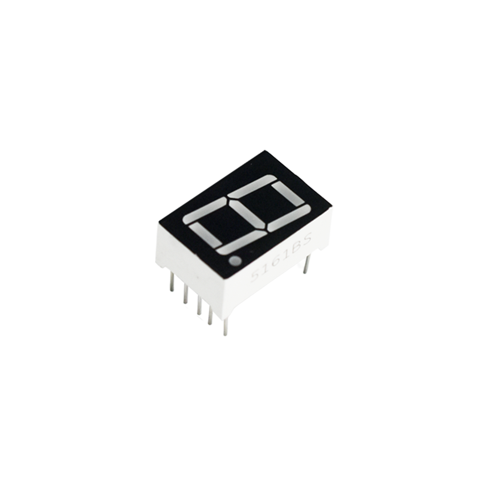
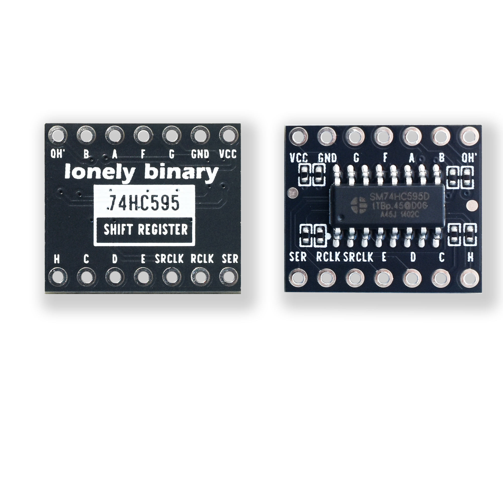
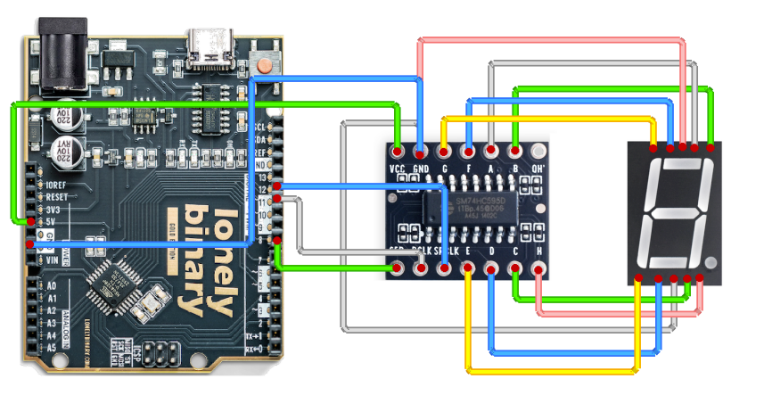
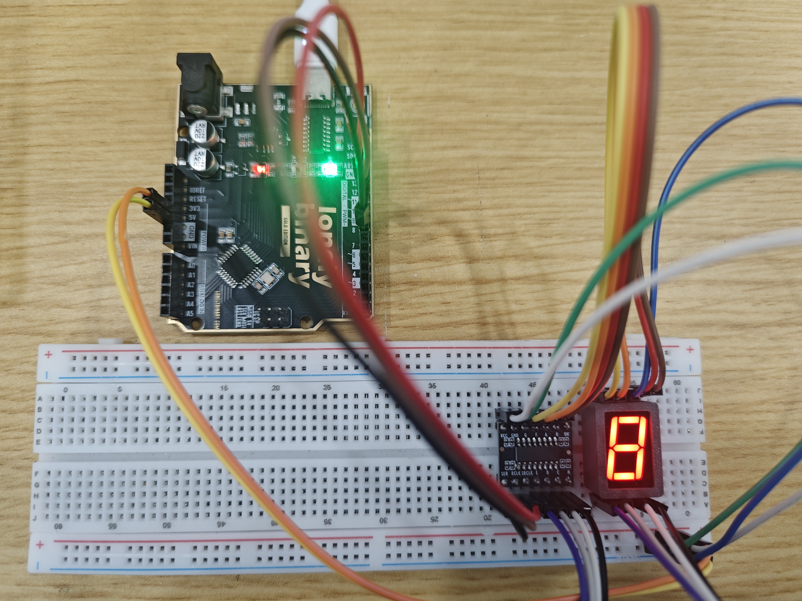
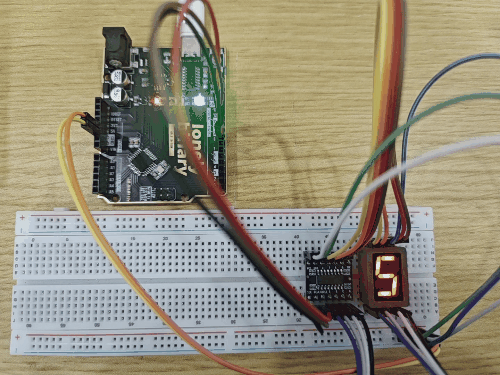

# 0.56 Seven Segment LED Display

## Function

This is a **0.56" single‑digit 7‑segment LED display kit**, suitable for showing a single numeric character (e.g. counters, status codes, simple values).

This kit includes:

- **7‑segment display**
- **74HC595 driver board** (serial‑to‑parallel)

Control interface (3 wires):

- **SER**: serial data (often labeled DS)
- **SRCLK**: shift clock (often labeled SHCP)
- **RCLK**: latch clock (often labeled STCP)

This folder provides:

- **Photos / images**: see `images/`
- **Arduino UNO R3 demo sketch**: see “Arduino Uno R3 Example” below and `codes/`

## Appearance

|  |  |
| :--: | :--: |
| **7‑segment side** | **74HC595 driver board** |

## Quick Start (UNO R3)

1. Open `codes/Uno_056SEG.ino` in Arduino IDE
2. Wire SER/RCLK/SRCLK as described in “Arduino Uno R3 Example”
3. Select **Arduino Uno** and the correct port, then upload

## Arduino Uno R3 Example

### Goal

Use Arduino Uno R3 + 74HC595 driver board to display **0~9** in a loop.

### Wiring





Connect the three control lines according to the driver board silkscreen:

- **SER** → Arduino Uno R3 digital pin (example: D8)
- **SRCLK** → Arduino Uno R3 digital pin (example: D12)
- **RCLK** → Arduino Uno R3 digital pin (example: D11)

Connect the remaining power pins to **5V** and **GND** according to the driver board silkscreen.

7‑segment pin mapping note (with the decimal point at the **bottom‑right**):

- There are **5 pins** on the top and **5 pins** on the bottom.
- The middle pin on the top and the middle pin on the bottom are **common pins**; connect **both to GND**.
- The other 4 top pins connect to the 74HC595 board pins **G F A B** (in order).
- The other 4 bottom pins connect to the 74HC595 board pins **E D C H** (in order).

### Code

File: `codes/Uno_056SEG.ino`

```cpp
// 0.56" single-digit 7-seg + 74HC595 driver board
// Interface: SER(DS), SRCLK(SHCP), RCLK(STCP)

const int PIN_SER   = 8;   // SER / DS
const int PIN_SRCLK = 12;  // SRCLK / SHCP
const int PIN_RCLK  = 11;  // RCLK / STCP

const int stepDelayMs = 500;

static void shiftWrite(uint8_t data) {
  digitalWrite(PIN_RCLK, LOW);
  shiftOut(PIN_SER, PIN_SRCLK, MSBFIRST, data);
  digitalWrite(PIN_RCLK, HIGH);
}

// Digit table: 0~9
const uint8_t kDigits[10] = {
  0b00111111, // 0
  0b00000110, // 1
  0b01011011, // 2
  0b01001111, // 3
  0b01100110, // 4
  0b01101101, // 5
  0b01111101, // 6
  0b00000111, // 7
  0b01111111, // 8
  0b01101111  // 9
};

void setup() {
  pinMode(PIN_SER, OUTPUT);
  pinMode(PIN_SRCLK, OUTPUT);
  pinMode(PIN_RCLK, OUTPUT);

  // Clear on power-up (all off)
  shiftWrite(0);
}

void loop() {
  for (int i = 0; i <= 9; i++) {
    shiftWrite(kDigits[i]);
    delay(stepDelayMs);
  }
}
```

### Effect



### Code Walkthrough

**1) 3-wire control**

- `SER`: shifts in 1 bit of data
- `SRCLK`: each clock edge shifts the bit into the 74HC595
- `RCLK`: latches the 8-bit value to the outputs

**2) Output update**

```cpp
digitalWrite(PIN_RCLK, LOW);
shiftOut(PIN_SER, PIN_SRCLK, MSBFIRST, data);
digitalWrite(PIN_RCLK, HIGH);
```

- `shiftOut(...)` sends one byte to the 74HC595.
- Latching with `RCLK` updates the segments at once.

