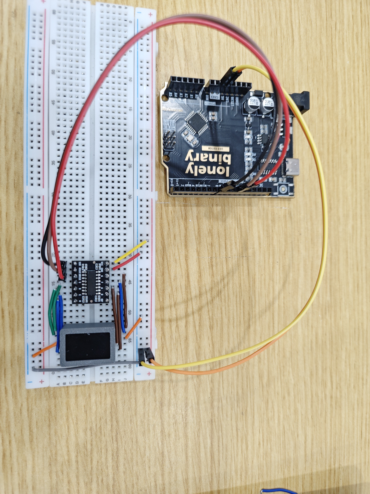
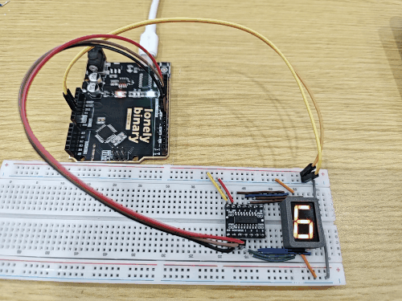

# 0.56 inch Seven Seg Display

## Function

This is a **0.56" single‑digit 7‑segment display kit**, suitable for showing a single numeric character (e.g. counters, status codes, simple values).

This kit includes:

## What You Will Learn

- How a **7-segment display** works (which LED lights up which part of a digit)
- What a **shift register** does and why it lets 3 wires control 8 outputs
- How **binary numbers** (like `0b00111111`) tell the display which segments to light
- What **common cathode** and **common anode** mean, and why they matter
- How to use `shiftOut()`, a built-in Arduino function for sending data serially

- **7‑segment display**
- **74HC595 driver board** (serial‑to‑parallel)

Control interface (3 wires, silkscreen **SER** / **SRCLK** / **RCLK**):

- **SER**: serial data
- **SRCLK**: shift clock
- **RCLK**: latch clock

This folder provides:

- **Photos / images**: see `images/`
- **Arduino UNO R3 demo sketch**: see “Arduino Uno R3 Example” below and `codes/`

## Appearance

|  |  |
| :--: | :--: |
| **7‑segment side** | **74HC595 driver board** |

## Digit type ↔ silkscreen (common cathode / anode)

Kits may include either type; check the **digit module** silkscreen / bag label.

| Type | Silkscreen / P/N | Common pin wiring | Demo sketch |
| :-- | :-- | :-- | :-- |
| **Common cathode** | `5161AS` | Connect **both** common pins to **GND** (as below) | `#define COMMON_ANODE 0` (default) |
| **Common anode** | `5161BS` | Connect **both** common pins to **5V** | `#define COMMON_ANODE 1` (inverts segment bytes; blank uses **0xFF**) |

**Why:** With **5161AS**, a segment turns on when the 74HC595 line goes **high** (current into the segment). With **5161BS**, segments share **VCC** on the commons; each line must **sink** current, so segment **on** = **low** on the 595 output — the same `kDigits[]` pattern must be bitwise inverted. The demo sketch applies that inversion when **`#define COMMON_ANODE 1`**.

## Quick Start (UNO R3)

1. Identify **`5161AS`** vs **`5161BS`** on the digit (see the **Digit type ↔ silkscreen** section above for the silkscreen table and wiring notes).
2. Open `codes/Uno_056SEG.ino` in Arduino IDE and set **`#define COMMON_ANODE`** to **0** (`5161AS`) or **1** (`5161BS`) to match your digit and common-pin wiring.
3. Wire SER/RCLK/SRCLK as described in “Arduino Uno R3 Example”; wire **common pins** per your digit type
4. Select **Arduino Uno** and the correct port, then upload

## Arduino Uno R3 Example

### Goal

Use Arduino Uno R3 + 74HC595 driver board to display **0~9** in a loop.

### Wiring




Connect the three control lines according to the driver board silkscreen:

- **SER** → Arduino Uno R3 digital pin (example: D8)
- **SRCLK** → Arduino Uno R3 digital pin (example: D12)
- **RCLK** → Arduino Uno R3 digital pin (example: D11)

Connect the remaining power pins to **5V** and **GND** according to the driver board silkscreen.

7‑segment pin mapping note (with the decimal point at the **bottom‑right**):

- There are **5 pins** on the top and **5 pins** on the bottom.
- The middle pin on the top and the middle pin on the bottom are **common pins**:
  - **`5161AS` (common cathode):** connect **both to GND** (matches the demo sketch).
  - **`5161BS` (common anode):** connect **both to 5V**; in the sketch set **`#define COMMON_ANODE 1`** (segment bytes are inverted for you; blank uses **`0xFF`**).
- The other 4 top pins connect to the 74HC595 board pins **G F A B** (in order).
- The other 4 bottom pins connect to the 74HC595 board pins **E D C H** (in order).

### Code

> **New to shift registers?** Read the [Key Concepts](#key-concepts) section below first — it explains how the 74HC595 works, what each bit in the segment byte does, and why common-anode displays need inverted bytes.

File: `codes/Uno_056SEG.ino`

```cpp
// 0.56" single-digit 7-segment LED + 74HC595 driver board
// Three wires — silkscreen: SER / SRCLK / RCLK
//
// Digit silkscreen: 5161AS = common cathode (commons -> GND), 5161BS = common anode (commons -> 5V).
#define COMMON_ANODE 0  // 0 = 5161AS (commons -> GND), 1 = 5161BS (commons -> 5V)

const int PIN_SER   = 8;   // serial data to 595
const int PIN_SRCLK = 12;  // shift register clock
const int PIN_RCLK  = 11;  // storage register clock (latch)

const int stepDelayMs = 500;

// Shift one byte into the 595, then pulse RCLK to update the segment outputs.
static void shiftWrite(uint8_t data) {
  digitalWrite(PIN_RCLK, LOW);
  shiftOut(PIN_SER, PIN_SRCLK, MSBFIRST, data);
  digitalWrite(PIN_RCLK, HIGH);
}

// kDigits[] is authored for common-cathode polarity; invert on wire for common anode.
static uint8_t segOut(uint8_t raw) {
#if COMMON_ANODE
  return (uint8_t)~raw;
#else
  return raw;
#endif
}

static uint8_t blankPattern() {
#if COMMON_ANODE
  return 0xFF;
#else
  return 0;
#endif
}

// Segment bitmap for digits 0..9 (MSBFIRST). Bit layout matches this board + demo wiring.
const uint8_t kDigits[10] = {
  0b00111111, // 0
  0b00000110, // 1
  0b01011011, // 2
  0b01001111, // 3
  0b01100110, // 4
  0b01101101, // 5
  0b01111101, // 6
  0b00000111, // 7
  0b01111111, // 8
  0b01101111  // 9
};

void setup() {
  pinMode(PIN_SER, OUTPUT);
  pinMode(PIN_SRCLK, OUTPUT);
  pinMode(PIN_RCLK, OUTPUT);

  shiftWrite(blankPattern());
}

void loop() {
  for (int i = 0; i <= 9; i++) {
    shiftWrite(segOut(kDigits[i]));
    delay(stepDelayMs);
  }
}
```

### Effect



### Code Walkthrough

**1) 3-wire control**

- Silkscreen on the driver board: **SER**, **SRCLK**, **RCLK**.
- `SER`: shifts in 1 bit of data
- `SRCLK`: each clock edge shifts the bit into the 74HC595
- `RCLK`: latches the 8-bit value to the outputs

**2) Output update**

```cpp
digitalWrite(PIN_RCLK, LOW);
shiftOut(PIN_SER, PIN_SRCLK, MSBFIRST, data);
digitalWrite(PIN_RCLK, HIGH);
```

- `shiftOut(...)` sends one byte to the 74HC595.
- Latching with `RCLK` updates the segments at once.
- In this sketch, `data` is **`blankPattern()`** at startup, and **`segOut(kDigits[i])`** in the main loop (see **3) `COMMON_ANODE`** below).

**3) `COMMON_ANODE`**

- Set **`#define COMMON_ANODE 0`** for **`5161AS`** (commons → **GND**); segment bytes go to the 595 as in `kDigits[]`, blank = **0**.
- Set **`#define COMMON_ANODE 1`** for **`5161BS`** (commons → **5V**); `segOut()` inverts each byte; blank = **0xFF**.

## Key Concepts

### How a 7-Segment Display Works

A 7-segment display has **seven LED bars** (segments) plus a decimal-point dot (H). Each segment has a letter name:

```
  AAA          Bit:  7  6  5  4  3  2  1  0
 F   B         Seg:  H  G  F  E  D  C  B  A
 F   B
  GGG          H = decimal point (dot)
 E   C
 E   C
  DDD
```

The byte you send to the 74HC595 has **8 bits**. Each bit controls one segment:
- Bit = **1** → segment **ON**
- Bit = **0** → segment **OFF**

**Example — digit "0"** needs A B C D E F on, G and H off:

```
Bit:   7  6  5  4  3  2  1  0
Seg:   H  G  F  E  D  C  B  A
Value: 0  0  1  1  1  1  1  1  =  0b00111111  =  0x3F
```

To show **"1"** (only B and C on):

```
Bit:   7  6  5  4  3  2  1  0
Seg:   H  G  F  E  D  C  B  A
Value: 0  0  0  0  0  1  1  0  =  0b00000110  =  0x06
```

### What Is a Shift Register (74HC595)?

A shift register is a chip that converts **serial data** (bits sent one at a time) into **parallel outputs** (all 8 pins set at once). This means:

- You only need **3 wires** from the Arduino (SER, SRCLK, RCLK).
- The 74HC595 drives **8 output pins** — one for each segment.

Here is how data flows:

1. Pull **RCLK low** (lock the outputs while you send data).
2. Send 8 bits one at a time on **SER**, pulsing **SRCLK** after each bit.
3. Pull **RCLK high** — all 8 outputs update at once.

`shiftOut()` does steps 2 automatically; you only need to control RCLK yourself.

### Common Cathode vs. Common Anode

Inside the display, all segment LEDs share one leg:

- **Common cathode** (`5161AS`): the shared leg is connected to **GND**. A segment lights up when its output pin goes **HIGH** (current flows in).
- **Common anode** (`5161BS`): the shared leg is connected to **5 V**. A segment lights up when its output pin goes **LOW** (current flows out).

This is why the code inverts all the bits when `COMMON_ANODE 1` is set — the same pattern `0b00111111` becomes `0b11000000`, which has the opposite effect on the hardware.

## More Examples

### Display a Fixed Digit

To show the digit **5** and hold it on screen permanently:

```cpp
void setup() {
  pinMode(PIN_SER,   OUTPUT);
  pinMode(PIN_SRCLK, OUTPUT);
  pinMode(PIN_RCLK,  OUTPUT);

  shiftWrite(segOut(kDigits[5]));  // show "5" and leave it there
}

void loop() { }  // nothing — display stays as-is
```

Change `kDigits[5]` to `kDigits[0]` through `kDigits[9]` for any digit.

### Display the Letter "E"

The letter E uses segments A, D, E, F, G. Working out the byte:

```
Bit:   7  6  5  4  3  2  1  0
Seg:   H  G  F  E  D  C  B  A
Value: 0  1  1  1  1  0  0  1  =  0b01111001
```

```cpp
void setup() {
  pinMode(PIN_SER, OUTPUT); pinMode(PIN_SRCLK, OUTPUT); pinMode(PIN_RCLK, OUTPUT);
  shiftWrite(segOut(0b01111001));  // show "E"
}

void loop() { }
```

### Show Only the Decimal Point

```cpp
shiftWrite(segOut(0b10000000));  // bit 7 = H = decimal point only
```

## Try It Yourself

1. **Show a custom digit** — What segment byte do you need to display the letter **E**? (Segments A, F, G, E, D must be on.) Write that byte and call `shiftWrite()` with it in `setup()`.
2. **Change the speed** — Find `stepDelayMs = 500` and change it to `100`. How fast does it cycle now?
3. **Show only the decimal point** — The decimal point is bit 7. What byte has only bit 7 set? (Hint: `0b10000000` = `0x80`.) Send that to the display.
4. **Count backwards** — Change the `for` loop so `i` goes from **9 down to 0** (use `i--`).

## Troubleshooting

| Problem | Likely cause | What to try |
| :-- | :-- | :-- |
| Display shows nothing | Wrong common wiring | Check if your display is `5161AS` (GND) or `5161BS` (5V) and wire the common pins correctly |
| Display shows random segments | `COMMON_ANODE` setting is wrong | If your display is `5161BS`, set `#define COMMON_ANODE 1` in the code |
| All segments on at once | RCLK not pulsing correctly | Check that RCLK is wired to D11 (or whichever pin you set for `PIN_RCLK`) |
| Segments look like mirror image | SER / SRCLK wires are swapped | Swap the wires for SER and SRCLK and try again |
| Sketch does not upload | Wrong board or port | Go to **Tools → Board → Arduino Uno** and choose the correct **Port** |

