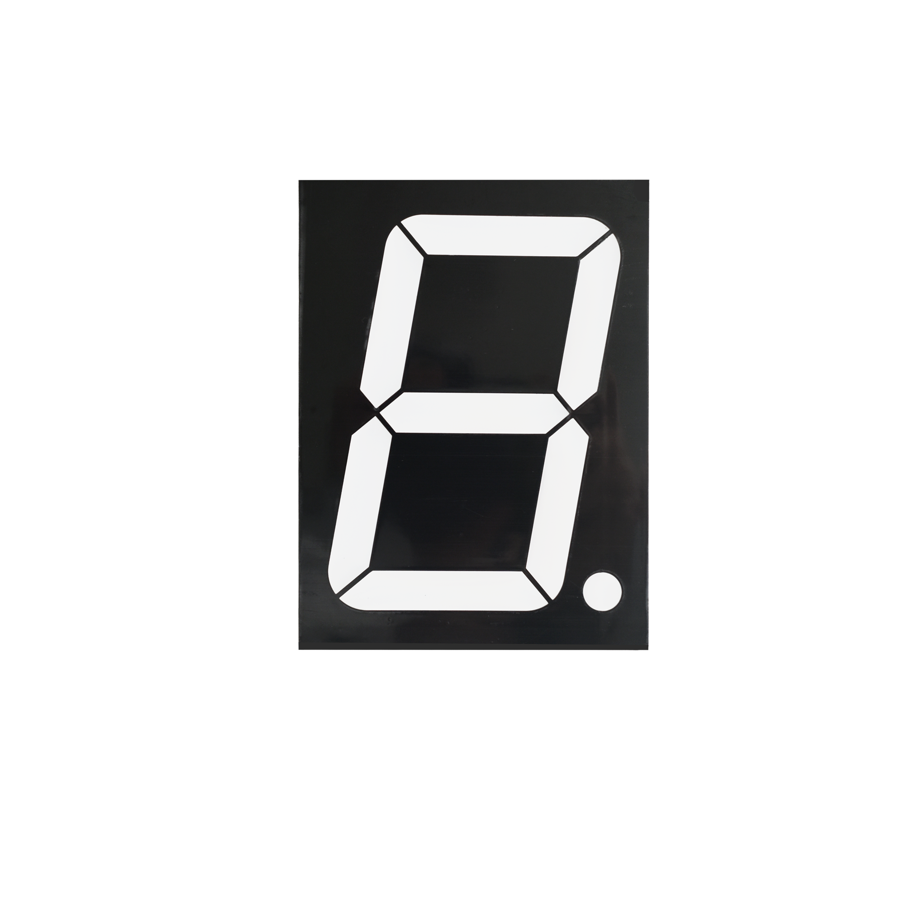
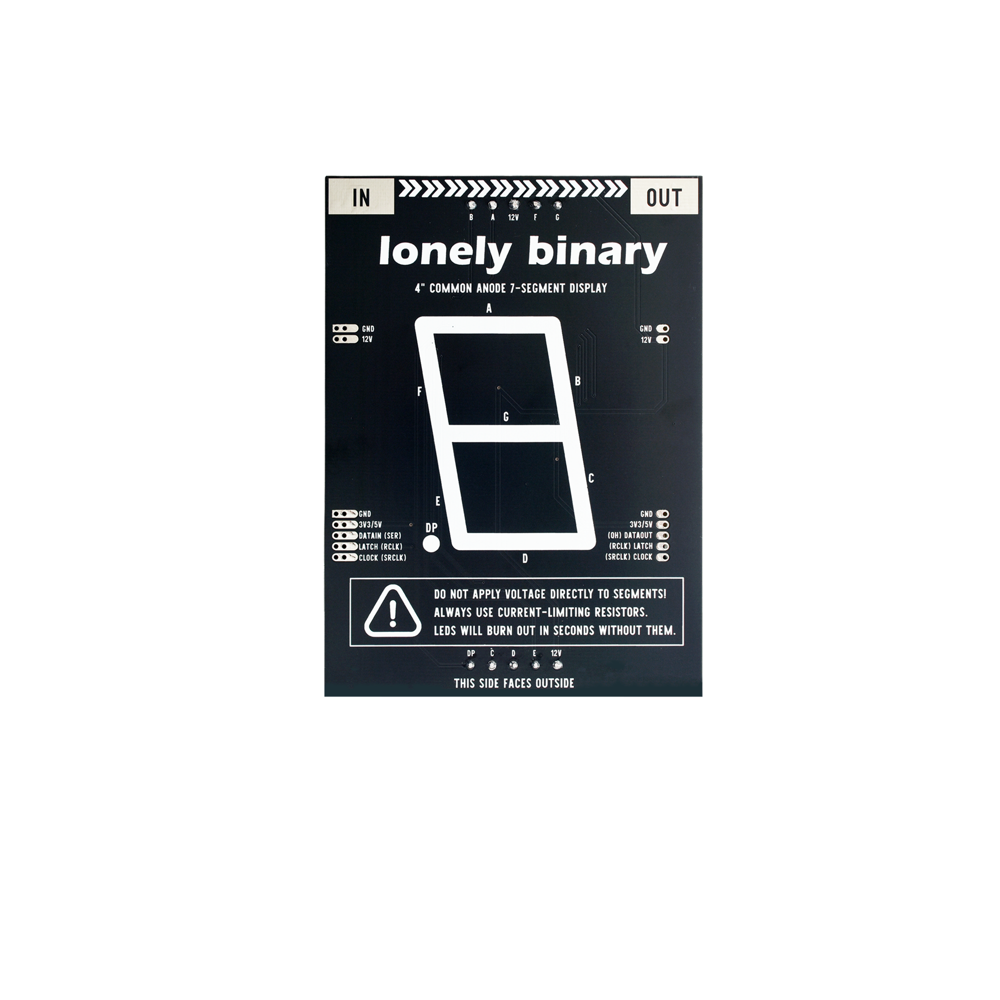
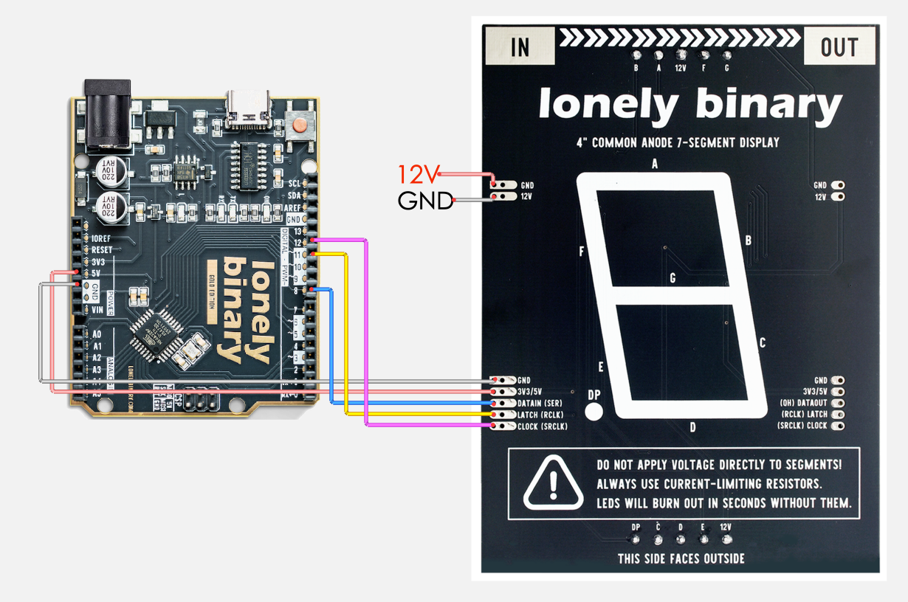
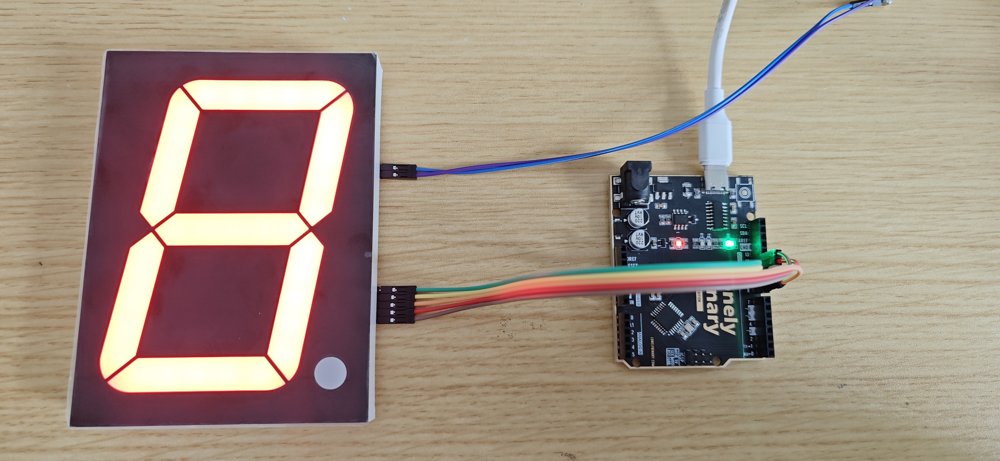
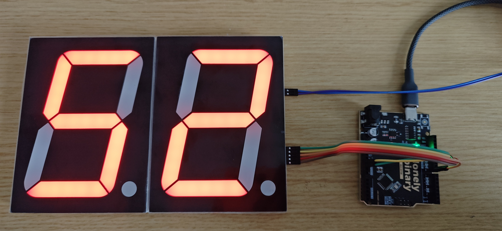
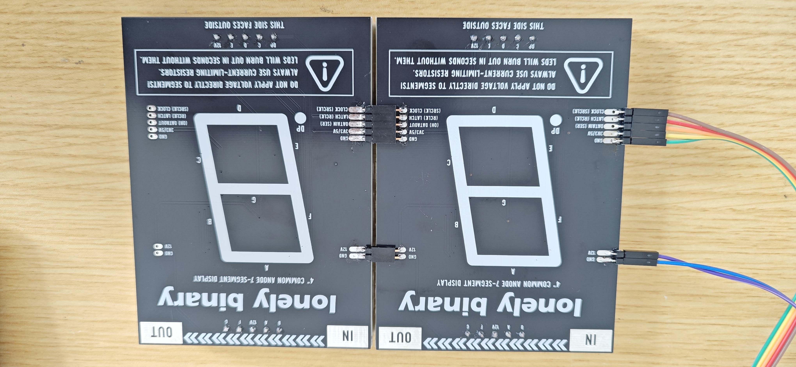

# 4 inch Seven Seg Display

## Function

This is a **4" seven-segment LED display kit** driven by **74HC595** shift registers. One module shows **0–9**; chain **DATAOUT (QH)** → next **DATAIN (SER)** for more digits (e.g. **00–99** with two modules).

This folder provides:

- **Photos / images**: see `images/`
- **Arduino UNO R3 demo sketch**: see “Arduino Uno R3 Example” below and `codes/Uno_47SEG.ino`

## Appearance

|  |  |
| :--: | :--: |
| **Front (component side)** | **Back (solder side)** |

## Quick Start (UNO R3)

1. Open `codes/Uno_47SEG.ino` in Arduino IDE and set **`#define NUM_DIGITS`** (e.g. **1** = single digit, **2** = two modules cascaded)
2. Wire as in “Arduino Uno R3 Example” (DATAIN side to Arduino; **12 V** from an external supply)
3. Select **Arduino Uno** and the correct port, then upload

## Arduino Uno R3 Example

### Goal

- **Single module:** show **0–9** (demo ends with decimal point only)
- **Cascade:** e.g. **00–99** when **`NUM_DIGITS`** is **2** (demo: all DPs blink, then count)

### Wiring

> **Direction:** connect the Arduino only to the **first** module’s **DATAIN (SER)**. Use **DATAOUT (QH)** only to the **next** module’s **DATAIN** — not to the MCU.
>
> **Power:** **12 V** must come from an **external 12 V supply** (the Uno does not provide 12 V). **5 V / 3V3** pins — use either rail.









Example pins (change in code if you rewire):

- **DATAIN (SER)** → D8  
- **CLOCK (SRCLK)** → D12  
- **LATCH (RCLK)** → D11  

### Code

File: `codes/Uno_47SEG.ino`

```cpp
// 4.7" seven-segment + 74HC595. MCU wires to first board DATAIN (SER) only; QH -> next DATAIN to cascade.
// How many 74HC595 / digit modules are chained in series
// 1 = single digit: 0–9 then decimal point only
// 2+ = all DPs blink 3×, then 0 … (10^NUM_DIGITS − 1)
#define NUM_DIGITS 2

#define SER   8   // DATAIN (SER) — change if you use other pins
#define CLK  12   // CLOCK (SRCLK)
#define LAT  11   // LATCH (RCLK)

#if NUM_DIGITS < 1
#error NUM_DIGITS must be >= 1
#endif

// Hex patterns for digits 0..9; 0x80 = decimal point (DP) only
const uint8_t d[] = {
  0x3F, 0x06, 0x5B, 0x4F, 0x66, 0x6D, 0x7D, 0x07, 0x7F, 0x6F
};

// Shift NUM_DIGITS bytes, then one LATCH edge to update the whole chain.
void outN(const uint8_t *buf) {
  digitalWrite(LAT, LOW);
  for (int i = 0; i < NUM_DIGITS; i++)
    shiftOut(SER, CLK, MSBFIRST, buf[i]);
  digitalWrite(LAT, HIGH);
}

void setup() {
  pinMode(SER, OUTPUT);
  pinMode(CLK, OUTPUT);
  pinMode(LAT, OUTPUT);
  uint8_t z[NUM_DIGITS];
  for (int i = 0; i < NUM_DIGITS; i++) z[i] = 0;
  outN(z);
}

#if NUM_DIGITS == 1

void loop() {
  uint8_t b[1];
  for (int i = 0; i < 10; i++) {
    b[0] = d[i];
    outN(b);
    delay(400);
  }
  b[0] = 0x80;
  outN(b);
  delay(500);
}

#else

void loop() {
  uint8_t b[NUM_DIGITS];

  // Blink every decimal point a few times
  for (int k = 0; k < 3; k++) {
    for (int i = 0; i < NUM_DIGITS; i++) b[i] = 0x80;
    outN(b);
    delay(200);
    for (int i = 0; i < NUM_DIGITS; i++) b[i] = 0;
    outN(b);
    delay(200);
  }

  unsigned long lim = 1UL;
  for (int i = 0; i < NUM_DIGITS; i++) lim *= 10UL;
  lim -= 1UL;

  // Count from 0 to lim; fill b[] with digit patterns (leading zeros included)
  for (unsigned long n = 0; n <= lim; n++) {
    unsigned long t = n;
    for (int i = NUM_DIGITS - 1; i >= 0; i--) {
      b[i] = d[t % 10UL];
      t /= 10UL;
    }
    outN(b);
    delay(400);
  }
}

#endif
```

### Effect

|  |  |
| :--: | :--: |
| **`NUM_DIGITS` 1** | **`NUM_DIGITS` 2** |

### Code Walkthrough

**1) 3-wire control**

- `SER` (DATAIN): serial data into the first 74HC595  
- `CLK` (SRCLK): shift clock — each edge used by `shiftOut`  
- `LAT` (RCLK): latch — after the bits (and extra bytes when cascaded) are shifted in, taking `LAT` high updates the outputs  

**2) Output update (one module — same idea as `0.56`)**

```cpp
digitalWrite(LAT, LOW);
shiftOut(SER, CLK, MSBFIRST, data);
digitalWrite(LAT, HIGH);
```

- `shiftOut(...)` sends **one** byte to the chain.  
- `LAT` low → shift → `LAT` high latches that byte to the segments.  

**3) Cascade: multiple bytes before one latch**

```cpp
// Shift NUM_DIGITS bytes, then one LATCH edge to update the whole chain.
void outN(const uint8_t *buf) {
  digitalWrite(LAT, LOW);
  for (int i = 0; i < NUM_DIGITS; i++)
    shiftOut(SER, CLK, MSBFIRST, buf[i]);
  digitalWrite(LAT, HIGH);
}
```

- Call `shiftOut` **`NUM_DIGITS`** times, **then** raise `LAT` once — one update for every digit in the chain.  
- If tens/ones look reversed, change the order of `buf[i]` or the `for` loop.  

**4) `NUM_DIGITS`, pins, and digit table**

```cpp
#define NUM_DIGITS 2

#define SER   8   // DATAIN (SER) — change if you use other pins
#define CLK  12   // CLOCK (SRCLK)
#define LAT  11   // LATCH (RCLK)

// Hex patterns for digits 0..9; 0x80 = decimal point (DP) only
const uint8_t d[] = {
  0x3F, 0x06, 0x5B, 0x4F, 0x66, 0x6D, 0x7D, 0x07, 0x7F, 0x6F
};
```

- `NUM_DIGITS`: how many 595 / digits are wired in series.  
- `d[]`: segment patterns for **0–9**; **`0x80`** is **DP** only.  

**5) Initialization (`setup`)**

```cpp
void setup() {
  pinMode(SER, OUTPUT);
  pinMode(CLK, OUTPUT);
  pinMode(LAT, OUTPUT);
  uint8_t z[NUM_DIGITS];
  for (int i = 0; i < NUM_DIGITS; i++) z[i] = 0;
  outN(z);
}
```

- All segment bytes start at **0** so the display is blank after reset.  

**6) Main loop — single digit (`NUM_DIGITS == 1`)**

```cpp
void loop() {
  uint8_t b[1];
  for (int i = 0; i < 10; i++) {
    b[0] = d[i];
    outN(b);
    delay(400);
  }
  b[0] = 0x80;
  outN(b);
  delay(500);
}
```

- First loop: show **0–9**.  
- Then **`0x80`**: decimal point only, then repeat.  

**7) Main loop — cascade (`NUM_DIGITS >= 2`)**

```cpp
void loop() {
  uint8_t b[NUM_DIGITS];

  // Blink every decimal point a few times
  for (int k = 0; k < 3; k++) {
    for (int i = 0; i < NUM_DIGITS; i++) b[i] = 0x80;
    outN(b);
    delay(200);
    for (int i = 0; i < NUM_DIGITS; i++) b[i] = 0;
    outN(b);
    delay(200);
  }

  unsigned long lim = 1UL;
  for (int i = 0; i < NUM_DIGITS; i++) lim *= 10UL;
  lim -= 1UL;

  // Count from 0 to lim; fill b[] with digit patterns (leading zeros included)
  for (unsigned long n = 0; n <= lim; n++) {
    unsigned long t = n;
    for (int i = NUM_DIGITS - 1; i >= 0; i--) {
      b[i] = d[t % 10UL];
      t /= 10UL;
    }
    outN(b);
    delay(400);
  }
}
```

- First block: blink **all** DPs **3** times (all `0x80`, then all `0`).  
- Second block: `lim` = **10^NUM_DIGITS − 1**; for each `n`, peel digits with `% 10` / `/ 10` into `b[]`, then `outN(b)` (leading zeros included).
