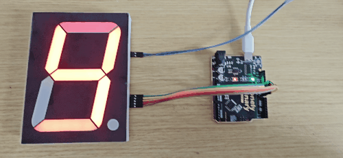
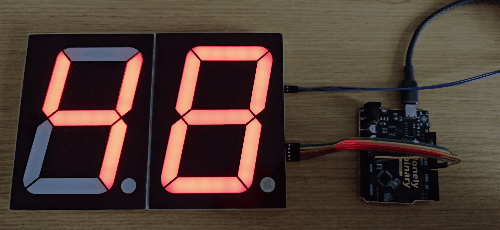

# 4 inch Seven Seg Display

## Function

This is a **4" seven-segment LED display kit** driven by **74HC595** shift registers. One module shows **0–9**; chain **DATAOUT (QH)** → next **DATAIN (SER)** for more digits (e.g. **00–99** with two modules).

## What You Will Learn

- How to control a large, bright 7-segment display with a **shift register**
- Why large LED displays need an **external 12 V power supply** (the Arduino cannot supply enough power)
- How to **cascade** (chain) multiple display modules using just 3 wires from the Arduino
- How **hexadecimal** (`0x3F`, `0x06`, …) represents segment patterns compactly
- How the **modulo (`%`) and division (`/`) operators** extract individual digits from a number

This folder provides:

- **Photos / images**: see `images/`
- **Arduino UNO R3 demo sketch**: see "Arduino Uno R3 Example" below and `codes/Uno_47SEG/Uno_47SEG.ino`

## Appearance

|  |  |
| :--: | :--: |
| **Front (component side)** | **Back (solder side)** |

## Assembly (Solder the Pin Headers First)

Each 4" module ships with **loose pin headers**. **Solder the pin headers to the DATAIN / DATAOUT / power rows on every module before plugging anything into a breadboard or a PinPlus Shield.** This applies to single-module use and to every module in a cascade.

> Friction-fit, jumper-wire, or press-and-hold contacts through the un-soldered holes are **not reliable**: a cascade will look like only the first module works, digits will appear randomly, or the display will stay dark — symptoms that are easy to mis-diagnose as cascade wiring or `NUM_DIGITS` problems. Soldering the included pin headers is the only reliable fix. See [Hardware Assembly (Soldering Required)](../README.md#hardware-assembly-soldering-required) in the main README.

## Quick Start (UNO R3)

1. Open `codes/Uno_47SEG/Uno_47SEG.ino` in Arduino IDE and set **`#define NUM_DIGITS`** (e.g. **1** = single digit, **2** = two modules cascaded)
2. Wire as in "Arduino Uno R3 Example" (DATAIN side to Arduino; **12 V** from an external supply)
3. Select **Arduino Uno** and the correct port, then upload

## Arduino Uno R3 Example

### Goal

- **Single module:** show **0–9** (demo ends with decimal point only)
- **Cascade:** e.g. **00–99** when **`NUM_DIGITS`** is **2** (demo: all DPs blink, then count)

### Wiring

> **Direction:** connect the Arduino only to the **first** module's **DATAIN (SER)**. Use **DATAOUT (QH)** only to the **next** module's **DATAIN** — not to the MCU.
>
> **Power:** **12 V** must come from an **external 12 V supply** (the Uno does not provide 12 V). **5 V / 3V3** pins — use either rail.


Example pins (change in code if you rewire):

- **DATAIN (SER)** → D8  
- **CLOCK (SRCLK)** → D12  
- **LATCH (RCLK)** → D11  

### Code

> **New to shift registers or hexadecimal?** Read the [Key Concepts](#key-concepts) section below before diving into the code — it explains how cascading works, what `0x3F` means, and how `%` and `/` extract digits from a number.

File: `codes/Uno_47SEG/Uno_47SEG.ino`

```cpp
#define NUM_DIGITS 2   // 1 = single module, 2 = two modules cascaded, 3 = three, etc.

#define SER   8   // DATAIN (SER)   → Arduino D8
#define CLK  12   // CLOCK  (SRCLK) → Arduino D12
#define LAT  11   // LATCH  (RCLK)  → Arduino D11

// Segment patterns for digits 0–9 (hex values, one byte each)
const uint8_t d[] = {
  0x3F,  // 0     0x06,  // 1     0x5B,  // 2     0x4F,  // 3     0x66,  // 4
  0x6D,  // 5     0x7D,  // 6     0x07,  // 7     0x7F,  // 8     0x6F   // 9
};

// Send all digit patterns to the chain, then latch once to update everything.
void updateDisplay(const uint8_t *buf) {
  digitalWrite(LAT, LOW);
  for (int i = 0; i < NUM_DIGITS; i++)
    shiftOut(SER, CLK, MSBFIRST, buf[i]);
  digitalWrite(LAT, HIGH);
}

void setup() {
  pinMode(SER, OUTPUT); pinMode(CLK, OUTPUT); pinMode(LAT, OUTPUT);
  uint8_t z[NUM_DIGITS];
  for (int i = 0; i < NUM_DIGITS; i++) z[i] = 0;
  updateDisplay(z);  // start blank
}

#if NUM_DIGITS == 1
void loop() {
  uint8_t b[1];
  for (int i = 0; i < 10; i++) { b[0] = d[i]; updateDisplay(b); delay(400); }
  b[0] = 0x80; updateDisplay(b); delay(500);  // 0x80 = decimal point only
}
#else
void loop() {
  uint8_t b[NUM_DIGITS];
  // Blink all decimal points 3 times
  for (int k = 0; k < 3; k++) {
    for (int i = 0; i < NUM_DIGITS; i++) b[i] = 0x80; updateDisplay(b); delay(200);
    for (int i = 0; i < NUM_DIGITS; i++) b[i] = 0;    updateDisplay(b); delay(200);
  }
  unsigned long lim = 1UL;
  for (int i = 0; i < NUM_DIGITS; i++) lim *= 10UL;
  lim -= 1UL;
  for (unsigned long n = 0; n <= lim; n++) {
    unsigned long t = n;
    for (int i = NUM_DIGITS - 1; i >= 0; i--) { b[i] = d[t % 10UL]; t /= 10UL; }
    updateDisplay(b); delay(400);
  }
}
#endif
```

### Effect

|  |  |
| :--: | :--: |
| **`NUM_DIGITS` 1** | **`NUM_DIGITS` 2** |

### Code Walkthrough

**1) 3-wire control**

- `SER` (DATAIN): serial data into the first 74HC595  
- `CLK` (SRCLK): shift clock — each edge used by `shiftOut`  
- `LAT` (RCLK): latch — after all bytes are shifted in, taking `LAT` high updates all outputs  

**2) Output update (one module)**

```cpp
digitalWrite(LAT, LOW);
shiftOut(SER, CLK, MSBFIRST, data);
digitalWrite(LAT, HIGH);
```

- `shiftOut(...)` sends **one** byte to the chain.  
- `LAT` low → shift → `LAT` high latches that byte to the segments.  

**3) Cascade: multiple bytes before one latch**

```cpp
void updateDisplay(const uint8_t *buf) {
  digitalWrite(LAT, LOW);
  for (int i = 0; i < NUM_DIGITS; i++)
    shiftOut(SER, CLK, MSBFIRST, buf[i]);
  digitalWrite(LAT, HIGH);
}
```

- Call `shiftOut` **`NUM_DIGITS`** times, **then** raise `LAT` once — one update for every digit in the chain.  
- If tens/ones look reversed, swap the order you fill `buf[]`.  

**4) `NUM_DIGITS`, pins, and digit table**

```cpp
#define NUM_DIGITS 2

// Segment patterns for digits 0–9; 0x80 = decimal point only
const uint8_t d[] = {
  0x3F, 0x06, 0x5B, 0x4F, 0x66, 0x6D, 0x7D, 0x07, 0x7F, 0x6F
};
```

- `NUM_DIGITS`: how many 595 / digit modules are wired in series.  
- `d[]`: segment patterns for **0–9**; **`0x80`** is **DP** only.  

**5) Initialization (`setup`)**

```cpp
void setup() {
  pinMode(SER, OUTPUT); pinMode(CLK, OUTPUT); pinMode(LAT, OUTPUT);
  uint8_t z[NUM_DIGITS];
  for (int i = 0; i < NUM_DIGITS; i++) z[i] = 0;
  updateDisplay(z);
}
```

- All segment bytes start at **0** so the display is blank after reset.  

**6) Main loop — single digit (`NUM_DIGITS == 1`)**

```cpp
void loop() {
  uint8_t b[1];
  for (int i = 0; i < 10; i++) {
    b[0] = d[i];
    updateDisplay(b);
    delay(400);
  }
  b[0] = 0x80;   // decimal point only
  updateDisplay(b);
  delay(500);
}
```

- First loop: show **0–9**.  
- Then **`0x80`**: decimal point only, then repeat.  

**7) Main loop — cascade (`NUM_DIGITS >= 2`)**

```cpp
unsigned long lim = 1UL;
for (int i = 0; i < NUM_DIGITS; i++) lim *= 10UL;
lim -= 1UL;

for (unsigned long n = 0; n <= lim; n++) {
  unsigned long t = n;
  for (int i = NUM_DIGITS - 1; i >= 0; i--) {
    b[i] = d[t % 10UL];   // t % 10 gives the rightmost digit
    t /= 10UL;             // drop the rightmost digit
  }
  updateDisplay(b);
  delay(400);
}
```

- `lim` = **10^NUM_DIGITS − 1** (e.g. 99 for 2 digits).  
- For each `n`, peel digits with `% 10` / `/ 10` into `b[]` right-to-left.

## Key Concepts

### Why 12 V External Power?

The large LEDs in a 4" display need significantly more current than the small LEDs in previous projects. The Arduino's 5 V pin can supply roughly 500 mA total — not enough. An **external 12 V supply** connects directly to the module's power input.

> **Safety note:** Always connect the Arduino GND and the external supply GND together. Without a shared ground the circuit will not work correctly.

### What Is Hexadecimal?

Hexadecimal (hex) uses **16 digits**: 0–9 and A–F (A=10, B=11, …, F=15). In C/C++, hex values start with `0x`.

The segment pattern for digit **0** is `0x3F`. In binary that is `00111111` — six bits on, matching six segments (A, B, C, D, E, F).

| Digit | Hex | Binary | Segments on |
| :---: | :-: | :-----: | :---------- |
| 0 | `0x3F` | `00111111` | A B C D E F |
| 1 | `0x06` | `00000110` | B C |
| 2 | `0x5B` | `01011011` | A B D E G |
| 7 | `0x07` | `00000111` | A B C |
| 8 | `0x7F` | `01111111` | A B C D E F G |

### How Cascading Works

Data flows through the chain like a queue. Each time you shift in a new byte, everything already in the chain moves one step forward.

```
Arduino
  │
  │ SER/CLK  ┌──────────────┐  DATAOUT    ┌──────────────┐
  └─────────►│   Module 1   ├────────────►│   Module 2   │
             │  (tens digit)│             │  (ones digit) │
             └──────────────┘             └──────────────┘
                      ▲                          ▲
                      └── LAT (shared) ──────────┘
                          one pulse updates both
```

Steps:
1. Pull `LAT` **LOW** (lock all outputs).
2. `shiftOut` byte for Module 1 → byte moves into Module 1.
3. `shiftOut` byte for Module 2 → byte for Module 2 enters Module 1, pushing Module 1's byte into Module 2.
4. Pull `LAT` **HIGH** → both modules update at the same moment.

### Extracting Digits with `%` and `/`

To split **37** into tens (3) and ones (7):

```cpp
ones = 37 % 10;   // remainder of 37 ÷ 10 = 7
tens = 37 / 10;   // integer part  of 37 ÷ 10 = 3
```

For any number of digits, the loop peels from right to left:

```cpp
for (int i = NUM_DIGITS - 1; i >= 0; i--) {
  b[i] = d[t % 10];  // ones place → rightmost position
  t /= 10;           // shift right by one decimal place
}
```

## More Examples

### Display a Fixed Number

To show a fixed value (e.g. **42**) and hold it permanently:

```cpp
void setup() {
  pinMode(SER, OUTPUT); pinMode(CLK, OUTPUT); pinMode(LAT, OUTPUT);

  uint8_t b[NUM_DIGITS];
  unsigned long val = 42;

  // Extract each digit right-to-left
  for (int i = NUM_DIGITS - 1; i >= 0; i--) {
    b[i] = d[val % 10];
    val /= 10;
  }
  updateDisplay(b);  // send to display and leave it there
}

void loop() {
  // nothing — display stays as-is
}
```

Set `#define NUM_DIGITS 2` and you will see **42** on the two-module chain.

## Try It Yourself

1. **Set `NUM_DIGITS 1` and count** — Start with one module, upload, and watch it count 0–9 with the decimal point at the end.
2. **Slow down the counting** — Change `delay(400)` to `delay(1000)`. Now each digit stays on for one full second.
3. **Add a third module** — If you have three modules, chain DATAOUT of module 2 to DATAIN of module 3, change `#define NUM_DIGITS 3`, and watch it count 000–999.
4. **Display a fixed number** — Copy the "Display a Fixed Number" example above. Change `val = 42` to any number you like.

## Troubleshooting

| Problem | Likely cause | What to try |
| :-- | :-- | :-- |
| Display is completely dark | No 12 V supply or GND not shared | Connect an external 12 V supply; make sure its GND is also connected to Arduino GND |
| Only the first module works | Cascade wiring wrong | Check that DATAOUT (QH) of module 1 goes to DATAIN (SER) of module 2 — **not** back to the Arduino |
| Digits appear in the wrong order | Byte order in `updateDisplay` is reversed | Swap the order you fill `buf[]`, or reverse the loop direction |
| Display flickers when counting | LAT pulsed too early | Make sure `LAT` goes `LOW` before the first `shiftOut` and `HIGH` only after the last one |
| Sketch does not compile | `NUM_DIGITS` set to 0 | The code requires `NUM_DIGITS >= 1`; change it to at least 1 |
| Sketch does not upload | Wrong board or port | Go to **Tools → Board → Arduino Uno** and choose the correct **Port** |
