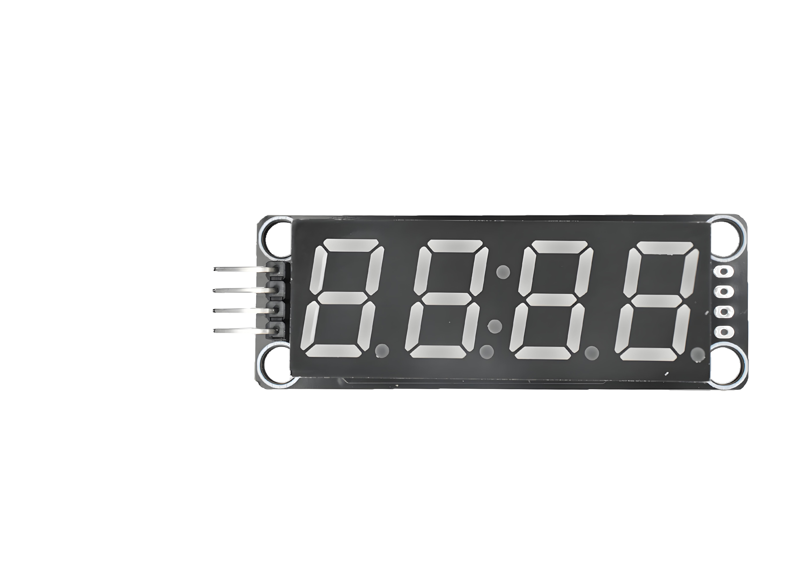
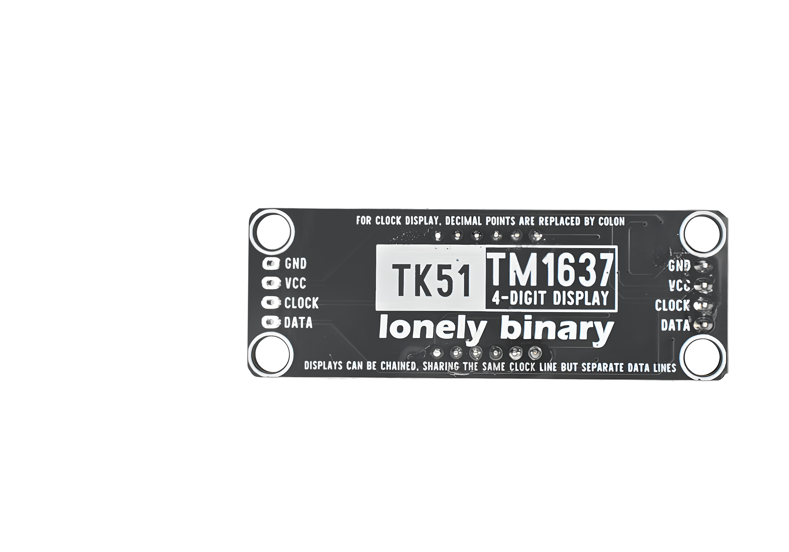
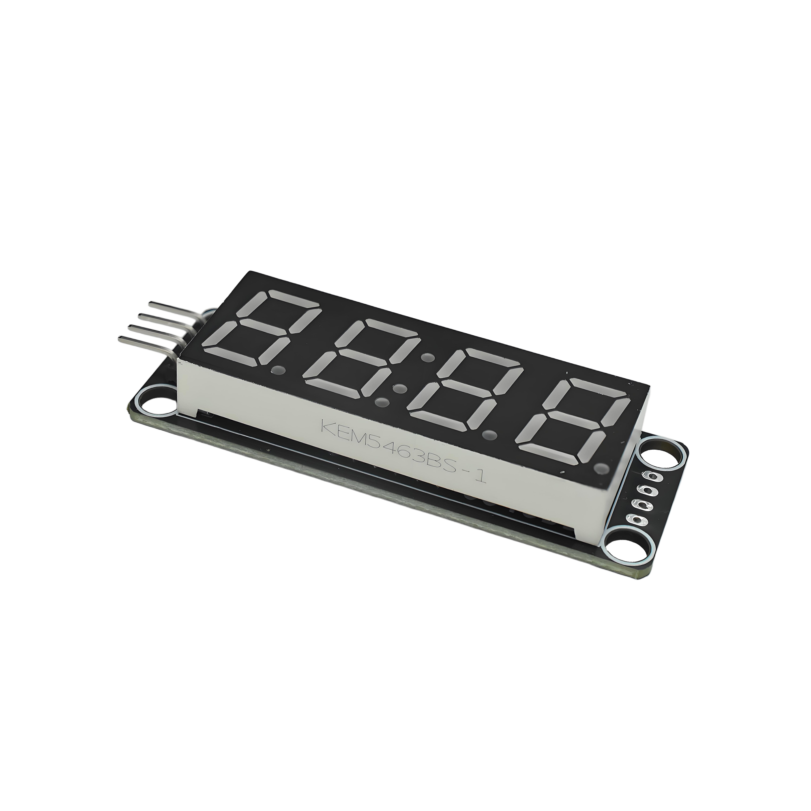
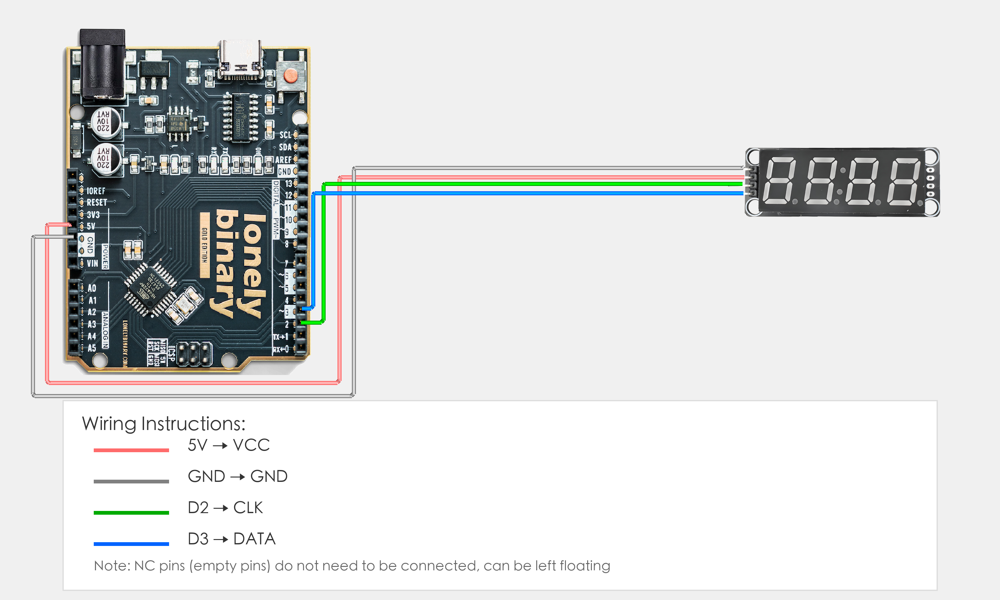
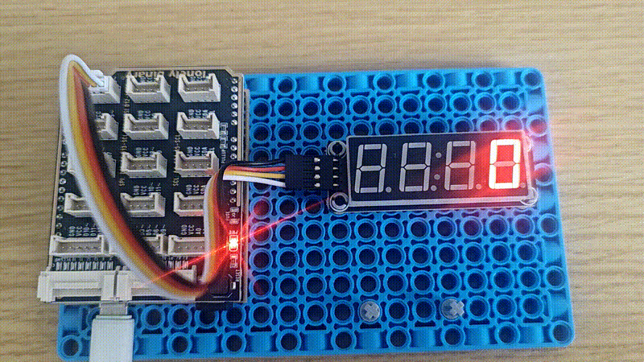

# TK51 - TM1637 4-Digit Display

## Function

TK51 is a **4-digit 7-segment LED display module** driven by **TM1637**. It uses a simple 2-wire interface (**CLK / DIO**) plus **VCC / GND**.

This folder provides:

- **Photos / images**: see `images/`
- **Arduino UNO R3 demo sketch**: see “Arduino Uno R3 Example” below and `codes/`

## Appearance

|  |  |  |
| :--: | :--: | :--: |
| **Front** | **Back** | **Side** |

## LED Color ↔ Silkscreen (P/N) Table

| LED color | Silkscreen / P/N |
| :-- | :-- |
| White | `5463BW-30` |
| Red | `5463BS1-1` |
| Blue | `5463BB` |
| Yellow | `5463BY` |
| Green | `5463BG-7.3` |
| Orange | `5643B0` |

## Quick Start (UNO R3)

1. Install the **TM1637Display** library in Arduino IDE (Library Manager: search `TM1637Display`).
2. Wire it as shown in “Arduino Uno R3 Example”.
3. Open `codes/Uno_TK51.ino`, select **Arduino Uno** and the correct port, then upload.

## Arduino Uno R3 Example

### Goal

Cycle through **0–9** on the 4-digit display.

### Wiring



Example Arduino connections (change in code if you rewire):

- **VCC** → **5V** (or 3.3V)
- **GND** → **GND**
- **CLK** → D2
- **DIO** → D3

### Code

File: `codes/Uno_TK51.ino`

```cpp
#include <TM1637Display.h>

// Change these to match your wiring
#define CLK_PIN 2
#define DIO_PIN 3

TM1637Display display(CLK_PIN, DIO_PIN);

void setup() {
  display.setBrightness(7);
}

void loop() {
  for (int i = 0; i < 10; i++) {
    display.showNumberDec(i * 1111, false);
    delay(1000);
  }
}
```

### Effect



### Code Walkthrough

**1) Library and pin mapping**

```cpp
#include <TM1637Display.h>
#define CLK_PIN 2
#define DIO_PIN 3
```

- `TM1637Display.h`: driver library for TM1637-based 4-digit modules.
- `CLK_PIN` / `DIO_PIN`: change these if you wire to different Arduino pins.

**2) Create display instance**

```cpp
TM1637Display display(CLK_PIN, DIO_PIN);
```

- The object talks to the TM1637 using the two-wire interface (**CLK / DIO**).

**3) Brightness**

```cpp
display.setBrightness(7);
```

- Brightness range is typically **0..7** (7 = brightest).

**4) Main loop**

```cpp
for (int i = 0; i < 10; i++) {
  display.showNumberDec(i * 1111, false);
  delay(1000);
}
```

- Loops `i = 0..9`.
- `i * 1111` makes all 4 digits show the same number (e.g. 2222, 5555).
- `delay(1000)` switches once per second.

