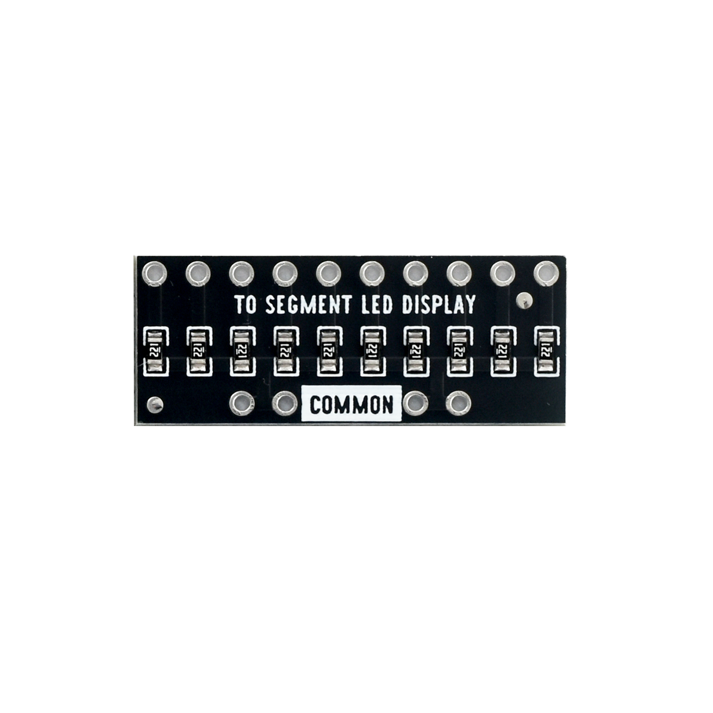
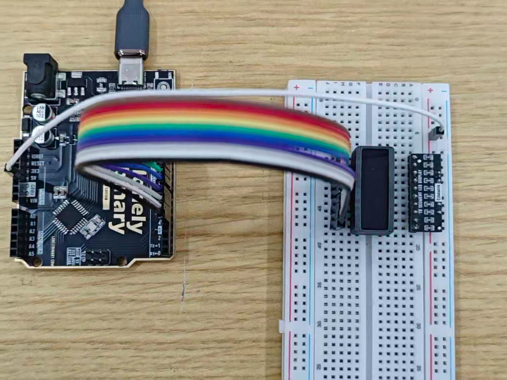

# Ten Seg LED Bar Display

## Function

Ten Seg LED Bar Display is a 10‑segment LED bar indicator. Each segment can be controlled independently, making it suitable for showing progress/level/status (e.g. battery, volume, signal strength, loading progress).

Each kit includes **multiple** Ten Seg LED Bar Display units (multiple pieces per box). This folder provides:

## What You Will Learn

- How to turn individual LEDs on and off using Arduino digital pins
- What **active-low logic** means (why writing `LOW` turns an LED **on**)
- How a **`for` loop** controls many pins with just a few lines of code
- What **`setup()`** and **`loop()`** functions do in an Arduino sketch
- How to adjust animation **speed** by changing a single number in the code

- **Photos / images**: see `images/`
- **Arduino UNO R3 demo sketch**: see “Arduino Uno R3 Example” below and `codes/`
- **3D printed enclosure**: see `3D-Printed Enclosure/`

## Appearance

|  |  |
| :--: | :--: |
| **Yellow (HD)** | **Resistor array module** |

## LED Color ↔ Silkscreen (P/N) Table

| LED color | Silkscreen / P/N |
| :-- | :-- |
| Green | `2501GG` |
| Yellow | `2510Y` |
| Red | `2510BS` |
| White | `2510BW` |
| Blue | `2510BB` |

## Quick Start (UNO R3)

1. Wire it as shown in “Arduino Uno R3 Example”
2. Open `codes/Uno_10SEG.ino` in Arduino IDE
3. Select **Arduino Uno** and the correct port, then upload

## Arduino Uno R3 Example

### Goal

Demonstrate basic control of the Ten Seg LED Bar Display with Arduino Uno R3:

- Use **D4~D13** to control 10 segments
- **Active‑low** (LOW = on, HIGH = off)
- Fill from one direction, then turn all off, repeat

### Wiring




> Wiring rule: the **text‑printed side** of the Ten Seg LED Bar Display connects to the **current‑limit resistor array**, and the other side connects to the **MCU**.
>
> Note: this example assumes Arduino **D4~D13** map to the 10 segment control pins.

### Code

File: `codes/Uno_10SEG.ino`

```cpp
// Ten Seg LED Bar Display — Arduino Uno R3 demo sketch
// Ten GPIOs drive ten segments (D4..D13). Active-low: LOW = segment on, HIGH = off.

const int firstPin = 4;
const int lastPin = 13;
const int stepDelayMs = 120;   // delay after each new segment turns on (fill speed)
const int allOffDelayMs = 300; // pause with all segments off before repeating

void setup() {
  for (int pin = firstPin; pin <= lastPin; pin++) {
    pinMode(pin, OUTPUT);
    digitalWrite(pin, HIGH); // active-low: start with all segments off
  }
}

void loop() {
  // Light segments one by one from D4 toward D13
  for (int pin = firstPin; pin <= lastPin; pin++) {
    digitalWrite(pin, LOW);
    delay(stepDelayMs);
  }

  // Turn all segments off, then repeat
  for (int pin = firstPin; pin <= lastPin; pin++) {
    digitalWrite(pin, HIGH);
  }
  delay(allOffDelayMs);
}
```

### Effect


> You can use the same wiring and sketch to test other colors of Ten Seg LED Bar Display in the kit.

### Code Walkthrough

**1) Pin range and delay parameters**

```cpp
const int firstPin = 4;
const int lastPin = 13;
const int stepDelayMs = 120;   // delay after each new segment turns on (fill speed)
const int allOffDelayMs = 300; // pause with all segments off before repeating
```

- `firstPin`/`lastPin`: use **D4~D13** (10 digital pins) to drive the 10 segments.
- `stepDelayMs`: speed of the fill animation.
- `allOffDelayMs`: pause after turning all segments off.

**2) Initialization (setup)**

```cpp
void setup() {
  for (int pin = firstPin; pin <= lastPin; pin++) {
    pinMode(pin, OUTPUT);
    digitalWrite(pin, HIGH); // active-low: start with all segments off
  }
}
```

- Set D4~D13 as outputs.
- Because the display is **active‑low**, `HIGH` means off. Power‑up starts with all segments off.

**3) Main loop (loop)**

```cpp
void loop() {
  // Light segments one by one from D4 toward D13
  for (int pin = firstPin; pin <= lastPin; pin++) {
    digitalWrite(pin, LOW);
    delay(stepDelayMs);
  }

  // Turn all segments off, then repeat
  for (int pin = firstPin; pin <= lastPin; pin++) {
    digitalWrite(pin, HIGH);
  }
  delay(allOffDelayMs);
}
```

- First loop: write `LOW` from D4 to D13 to **fill** the bar.
- Second loop: write `HIGH` to turn **all segments off**.
- `delay(...)` controls the animation timing.

## Key Concepts

### What Is an LED?

An **LED** (Light-Emitting Diode) is a tiny light that turns on when electricity flows through it in the correct direction. Each of the 10 segments in the bar is one LED. The Arduino controls each LED by setting a pin to `HIGH` (5 V) or `LOW` (0 V).

### What Is Active-Low Logic?

In this circuit the LEDs are wired so that the **low** voltage (0 V) turns them **on**, and the **high** voltage (5 V) turns them **off**. This is called **active-low**:

| Arduino pin state | Voltage | LED result |
| :-- | :-- | :-- |
| `LOW` | 0 V | **ON** (lit) |
| `HIGH` | 5 V | **OFF** (dark) |

This feels backwards at first, but it is a very common wiring pattern in electronics. The key is to remember: **LOW = on, HIGH = off** for this display.

### What Are `setup()` and `loop()`?

Every Arduino sketch has two required functions:

- **`setup()`** — runs **exactly once** when the Arduino powers up or resets. Use it to configure your pins and set their starting values.
- **`loop()`** — runs **over and over, forever**, until the power is cut. This is where your animation or main program lives.

### What Is a `for` Loop?

A `for` loop repeats a block of code a fixed number of times. Example:

```cpp
for (int pin = 4; pin <= 13; pin++) {
    digitalWrite(pin, LOW);
    delay(120);
}
```

This runs the two lines inside the `{ }` for `pin = 4`, then `pin = 5`, …, up to `pin = 13` — that is 10 steps, written in just 4 lines. Without a `for` loop you would need 20 separate lines to do the same thing.

### Why Do We Need Resistors?

LEDs require a **current-limiting resistor** to prevent too much electricity from flowing through them (which would burn them out). This kit provides a **resistor array module** that handles this automatically — you do not need to add separate resistors.

## Try It Yourself

Once the basic demo is working, try these changes:

1. **Change the speed** — In the code, change `stepDelayMs` from `120` to `50`. Upload again. What happens? Try `500` — what changes?
2. **Fill from the other end** — Change the `for` loop to count *down* from `lastPin` to `firstPin` (`pin--` instead of `pin++`). The bar will fill from the opposite direction.
3. **Light only the middle** — Use `digitalWrite` to turn on only pins D8 and D9, keeping all others off. Can you make just the center two segments glow?
4. **Make a back-and-forth sweep** — After filling up, add a second `for` loop that turns segments off one by one from the last pin back to the first.

## Troubleshooting

| Problem | Likely cause | What to try |
| :-- | :-- | :-- |
| No LEDs light up at all | Missing power or wrong wiring | Check that GND is connected and that D4–D13 match the diagram |
| All LEDs stay on and never turn off | `HIGH`/`LOW` are swapped in the code | Make sure `setup()` starts all pins `HIGH` (off), and `loop()` sets them `LOW` (on) |
| Only some segments light up | A loose or missing jumper wire | Wiggle each wire; try adding `digitalWrite(pin, LOW)` for one pin at a time in `setup()` to test each segment |
| Wrong segments light up in the wrong order | Wires are on the wrong pins | Check that D4 goes to segment 1, D5 to segment 2, and so on |
| The sketch does not upload | Wrong board or port selected | In Arduino IDE go to **Tools → Board** and choose **Arduino Uno**; then **Tools → Port** and pick the correct COM port |
