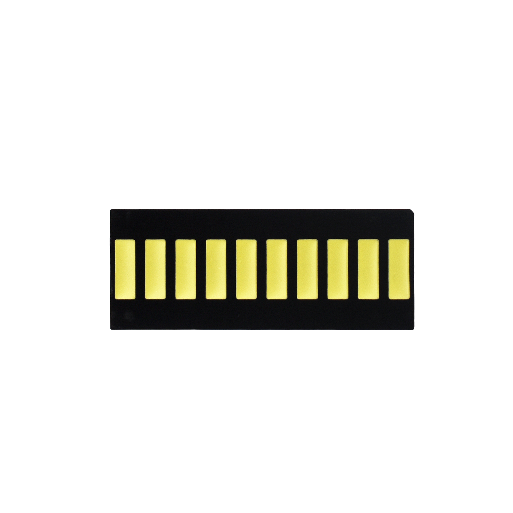
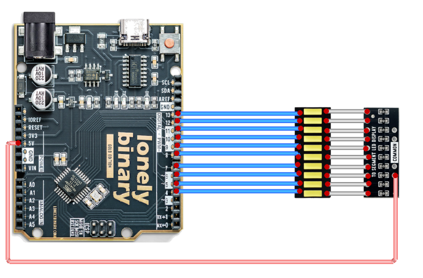
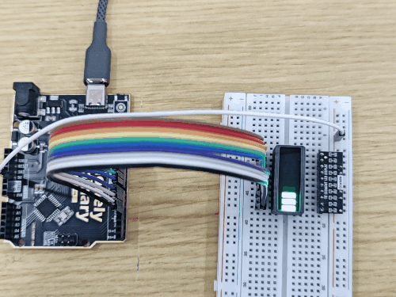

# Ten Segment LED Bar Display

## Function

Ten Segment LED Bar Display is a 10‑segment LED bar indicator. Each segment can be controlled independently, making it suitable for showing progress/level/status (e.g. battery, volume, signal strength, loading progress).

This product may include multiple Ten Segment LED Bar Displays. This folder provides:

- **Photos / images**: see `images/`
- **Arduino UNO R3 demo sketch**: see “Arduino Uno R3 Example” below and `codes/`
- **3D printed enclosure**: see `3D-Printed Enclosure/`

## Appearance

|  |  |
| :--: | :--: |
| **Yellow (HD)** | **Resistor array module** |

## Quick Start (UNO R3)

1. Wire it as shown in “Arduino Uno R3 Example”
2. Open `codes/Uno_10SEG.ino` in Arduino IDE
3. Select **Arduino Uno** and the correct port, then upload

## Arduino Uno R3 Example

### Goal

Demonstrate basic control of the Ten Segment LED Bar Display with Arduino Uno R3:

- Use **D4~D13** to control 10 segments
- **Active‑low** (LOW = on, HIGH = off)
- Fill from one direction, then turn all off, repeat

### Wiring




> Wiring rule: the **text‑printed side** of the Ten Segment LED Bar Display connects to the **current‑limit resistor array**, and the other side connects to the **MCU**.
>
> Note: this example assumes Arduino **D4~D13** map to the 10 segment control pins.

### Code

File: `codes/Uno_10SEG.ino`

```cpp
// UNO R3: D4~D13, active-low (LOW=on, HIGH=off)
const int firstPin = 4;
const int lastPin = 13;
const int stepDelayMs = 120;   // step delay
const int allOffDelayMs = 300; // all-off delay

void setup() {
  for (int pin = firstPin; pin <= lastPin; pin++) {
    pinMode(pin, OUTPUT);
    digitalWrite(pin, HIGH);
  }
}

void loop() {
  // Fill in one direction
  for (int pin = firstPin; pin <= lastPin; pin++) {
    digitalWrite(pin, LOW);
    delay(stepDelayMs);
  }

  // All off, then repeat
  for (int pin = firstPin; pin <= lastPin; pin++) {
    digitalWrite(pin, HIGH);
  }
  delay(allOffDelayMs);
}
```

### Effect



> You can use the same wiring and sketch to test other colors of Ten Segment LED Bar Display in the kit.

### Code Walkthrough

**1) Pin range and delay parameters**

```cpp
const int firstPin = 4;
const int lastPin = 13;
const int stepDelayMs = 120;
const int allOffDelayMs = 300;
```

- `firstPin`/`lastPin`: use **D4~D13** (10 digital pins) to drive the 10 segments.
- `stepDelayMs`: speed of the fill animation.
- `allOffDelayMs`: pause after turning all segments off.

**2) Initialization (setup)**

```cpp
void setup() {
  for (int pin = firstPin; pin <= lastPin; pin++) {
    pinMode(pin, OUTPUT);
    digitalWrite(pin, HIGH);
  }
}
```

- Set D4~D13 as outputs.
- Because the display is **active‑low**, `HIGH` means off. Power‑up starts with all segments off.

**3) Main loop (loop)**

```cpp
void loop() {
  for (int pin = firstPin; pin <= lastPin; pin++) {
    digitalWrite(pin, LOW);
    delay(stepDelayMs);
  }

  for (int pin = firstPin; pin <= lastPin; pin++) {
    digitalWrite(pin, HIGH);
  }
  delay(allOffDelayMs);
}
```

- First loop: write `LOW` from D4 to D13 to **fill** the bar.
- Second loop: write `HIGH` to turn **all segments off**.
- `delay(...)` controls the animation timing.
